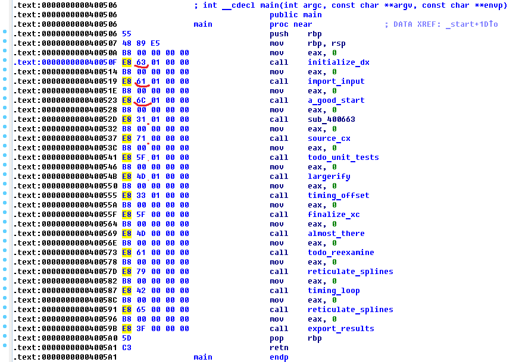

# OpenCTF : Artisinal Assembly

**Category:** Tasks
**Points:** 
**Solves:** 
**Description:**

> {'solve_count': 6, 'description': u"Well I just loaded,\n    and this is crazy,\nbut here's my address,\n    172.31.0.10/artisinal_assembly_0331fb4526b5ffee34f6ab66899bac0b", 'total_scored': 900, 'challenge_name': u'Artisinal Assembly', 'point_value': 150, 'open': 1}

> file: [172.31.0.10/artisinal_assembly_0331fb4526b5ffee34f6ab66899bac0b](artisinal_assembly_0331fb4526b5ffee34f6ab66899bac0b)

## Write-up

`"\x63\x61\x6C\x31\x71\x5F\x4D\x33\x5F\x4D\x61\x79\x42\x65\x3F" == cal1q_M3_MayBe?`, the flag.

... and "symbol_stego" is misleading.

## Other write-ups and resources

* none yet
