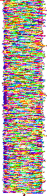

# Break In 2016 - Eighth Circles of Hell

**Category:** Steganography
**Points:** 200
**Solves:** 17
**Description:**

> It’s Star Wars time again, and you found a hidden message from R2D2, it 
> supposedly can be decrypted of the Dark Force, help the Resistance to decode 
> the message.
> 
> 

## Write-up

by [ParthKolekar](https://github.com/ParthKolekar)

The title has a hint towards the content of the strange image attached. 
Eight Circles of Hell is the name given to Malbolge after its crazy twisted
syntax, preventing all but the most dedicated to write code in it. 

And indeed I would be suripised if I find any real program written in malbolge
which does something non trivial. 

The image is actually a code written in another esoteric language piet.

On passing the via a piet intepreter, we get the following output.

     RCdgJHFwIkp9fXtGeXk2L2V0MmJOTkwnLGwqaignZ2dle0FjP2A8eykoeHdZb3Rzcmsxb1FQbGtkKilKSWVkY2JbIUJYV1ZbWlN3V1ZVN1NSS29JSGxGLkpDQkdAZERDQiQjPzhcNnw6MzJWNjU0MzIxKnAoTG0lSSMiJ34lJHtBYn59dnV0OnhxWXV0bTNUcGluZ2xrZCpoZ2BIXiRiRFpfXl1WelRTWFdWVU5yTFFKT05NTEVEaEJBZShEQ0JBOl44PTw7NDkyVjA1LjMyK08vKC0sKyojRyEmfSR7ekB+d197enM5WnZvdG0zcXBvbm1mTitpS2dmZV4kXFtaWV5XXFV5U1hRdVVUU0xLbzJOR0ZqLUlIR0BkPkM8YCM/OFw8NXszVzc2djQzLCtPL28nLCskI0cnJmZlI3p5eD5fe3R5cjhZdW40bGtwaWguT2tkY2IoYGVeY1xbIUJeV1ZVeVlYOlBPVE1xUTMySEdMS0RoSCpGRT5iJUE6Pzg3Wzs0M1c3dzUuUixyMC8uLSwlSWooJ35EfHt6eT9gX3t0eXJ3cDZuc3JxcGkvbWxlamloZ2ZfXl0jYWBCQV1cW1R4WFdWOE5TUktKbjFNTEtKQ2dBRkVEPWEkOj8+PTw1NFg4eDYvU3RzMTApTS0sbGsjRycmJXxkInk/YF91dHM5d3ZYdG1sazFvbm1sZU0qdQ==

Clearly this is a base64 encoded string, so we decode it to get this
        
    D'`$qp"J}}{Fyy6/et2bNNL',l*j('gge{Ac?`<{)(xwYotsrk1oQPlkd*)JIedcb[!BXWV[ZSwWVU7SRKoIHlF.JCBG@dDCB$#?8\6|:32V654321*p(Lm%I#"'~%${Ab~}vut:xqYutm3Tpinglkd*hg`H^$bDZ_^]VzTSXWVUNrLQJONMLEDhBAe(DCBA:^8=<;492V05.32+O/(-,+*#G!&}${z@~w_{zs9Zvotm3qponmfN+iKgfe^$\[ZY^W\UySXQuUTSLKo2NGFj-IHG@d>C<`#?8\<5{3W76v43,+O/o',+$#G'&fe#zyx>_{tyr8Yun4lkpih.Okdcb(`e^c\[!B^WVUyYX:POTMqQ32HGLKDhH*FE>b%A:?87[;43W7w5.R,r0/.-,%Ij('~D|{zy?`_{tyrwp6nsrqpi/mlejihgf_^]#a`BA]\[TxXWV8NSRKJn1MLKJCgAFED=a$:?>=<54X8x6/Sts10)M-,lk#G'&%|d"y?`_uts9wvXtmlk1onmleM*u

This is malbolge.

We now pass it via a Malbolge intepreter.

    Good work finding this shit. Your flag is dafuck_how_did_you_find_this!

The flag is `dafuck_how_did_you_find_this!`

## Other write-ups and resources

* <https://takt0rs.wordpress.com/2016/01/25/break-in-2106-eighth-circle-of-hell/>
