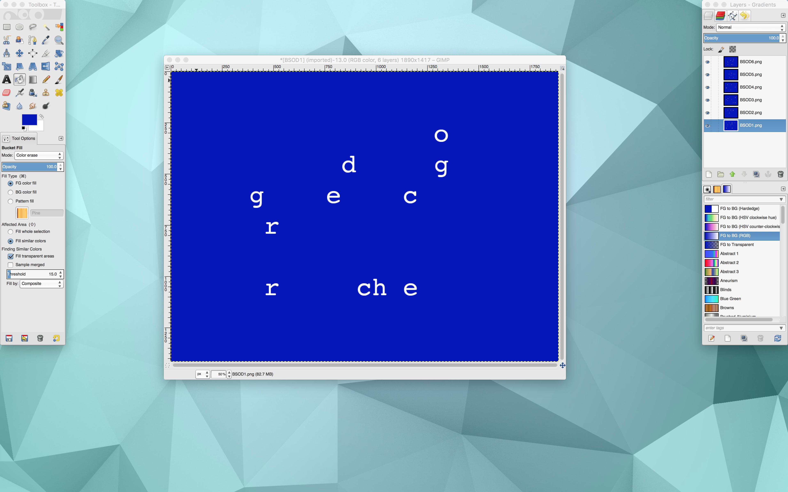
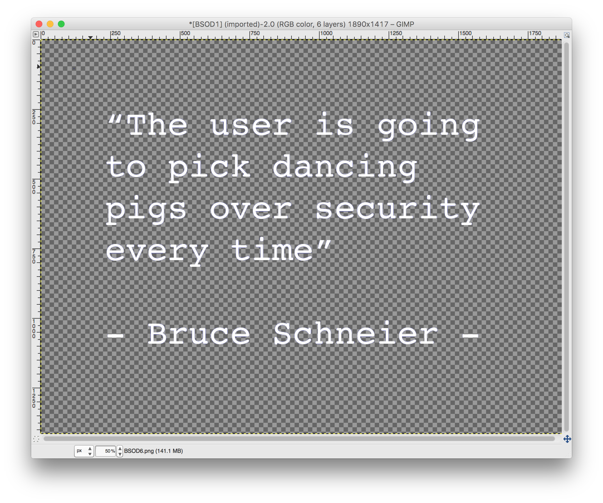

# Cyber Security Challenge 2016: BSOD Quote

**Category:** Cryptography  
**Points:** 15  
**Challenge designer:** Nico Callens  
**Description:**  
> Find the flag in [this file](https://s3-eu-west-1.amazonaws.com/be.cscbe.challenges/Cryptography+-+BSOD+quote+-+Nico+Callens/BSOD.scr).  
> The solution is enclosed between quotes.

## Write-up
A .src (screensaver) file can be unzipped which will return all of the images used in the screensaver.
```
$ unzip BSOD.src
```

Open GIMP, File -> Open as Layers, select all the screensaver images



Select Tools -> Paint Tools -> Bucket Fill and set the Mode to Color erase.
Now for each of the layers click on the blue background. All of the letters will show and the solution will be visible.



## Other write-ups and resources

