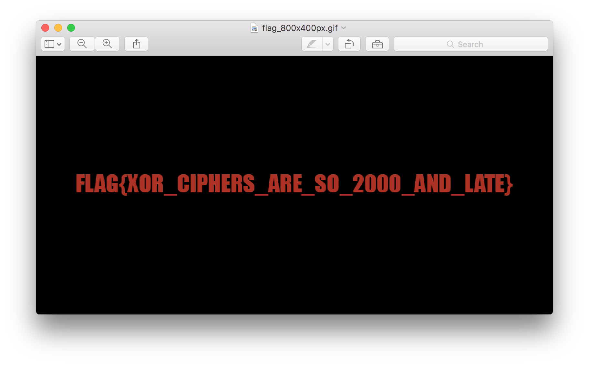

# Cyber Security Challenge 2016: In a jiffy

**Category:** Cryptography  
**Points:** 25  
**Challenge designer:** Michiel Meersmans  
**Description:**  
> Someone used this [NSA-approved-backdoor-free encryption program](challenge-source-files/encrypt.py) to encrypt the following [file](challenge-source-files/flag_800x400.gif.enc). Can you decrypt the file and prove it’s not so secure after all?  

**Hints:**
> \#1: <https://www.youtube.com/watch?v=9iafa959JvY>  
> \#2: What's in a name?

## Write-up
We start off by taking a look at the script used for encrypting the file.
The script starts off by generating a random 10 byte key and expands the key to the size of the file that needs to be encrypted by repeating it multiple times.
This expanded key is than used in a simple XOR encryption.

XOR encryptions have the property that if we XOR the ciphertext with the plaintext we’ll get the key. Looking at the file name of the encrypted file it contains “.gif” so it’s pretty safe to assume it’s a GIF image.

Performing a bit more research on the gif format:
<http://giflib.sourceforge.net/whatsinagif/bits_and_bytes.html>
<https://en.wikipedia.org/wiki/GIF#Example_GIF_file>

We learn that a GIF file always starts with a fixed 6 byte header, followed by 2 bytes of width and 2 bytes of height. The width and height are both in the filename too, so now we know the first 10 bytes of the plaintext file. We can XOR these bytes with the encrypted file to figure out the key and decrypt the entire image. The following python script does just that:

```
$ python solve.py
```



