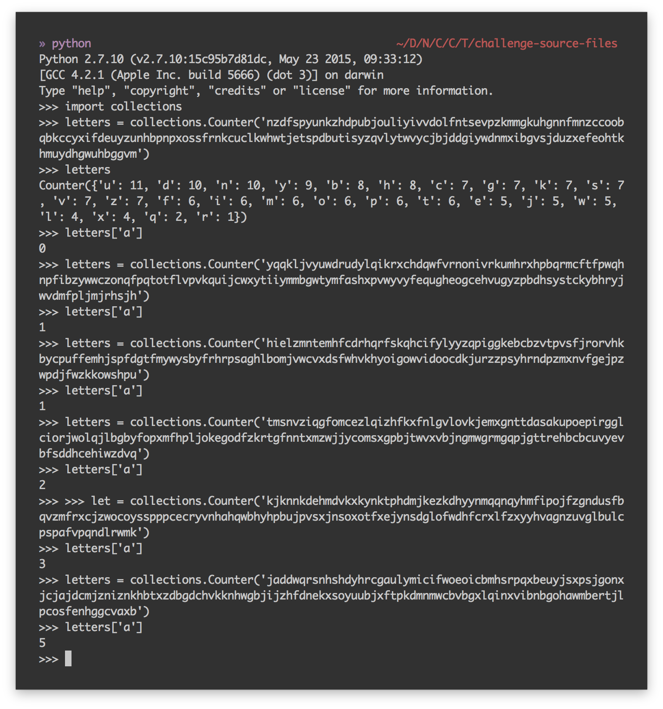

# Cyber Security Challenge 2016: This looks random

**Category:** Cryptography  
**Points:** 40  
**Challenge designer:** Daan Raman  
**Description:**  
> There is no way you are solving this challenge - it’s generating random strings of text!

> Note: don’t reverse the executable unless you like pain.  

> The solution is a 9 letter Italian word, all lower case.  
> [The executable](challenge-source-files/you_move_me) is non-harmful and can be run on a UNIX system (compiled on Kali).  

**Hints:**
> Perform a statistical analysis of each line printed, and see if you find a pattern.

## Write-up
If you run the program, it will print out apparently random strings, however, there is a statistical bias in the strings, on the letter A. Their frequency of appearance is linked to the fibonacci sequence.  
The challenge is in some way “solving itself” - it creates random strings until it has found one that matches the number of “A” characters identical to the Fibonacci number at that position in the sequence - so statistically less A’s in the first sentences printed, and more A’s in the later sentences printed. The longer you wait, the clearer the statistical bias will become.

```python
import random, string
import collections

def randomword(length):
   return ''.join(random.choice(string.lowercase) for i in range(length))

arr=[0, 51, 1, 62, 1, 89, 2, 66, 3, 100, 5, 289, 8, 192, 13, 223, 21, 22, 34, 10, 55, 4, 89]
c=0
search_char = "a"

while len(arr) > 0:
   c=c+1
   print str(c) + "\r",
   numbers_char_matched = 0
   stri =  randomword(160)
   str_count = stri.count(search_char)

   if str_count == arr[0]:
	print str(stri)
	arr.pop(0)
	arr.pop(0)

```

If you count the frequency of 'a' in each string you'll notice the fibonacci sequence

```python
>>> import collections
>>> letters = collections.Counter('string')
```



### Solution
fibonachi

*Note: fibonacci sequence = 0, 1, 1, 2, 3, 5, 8, 13, 21, 34, 55, 89, 144, 233, ...  
The string length is only 160 characters which means the frequency of a can only appear 160 times. So after 12 printed strings, the program should stop.*
