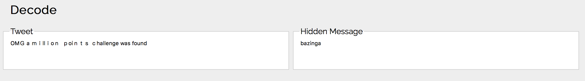

# Cyber Security Challenge 2016: What did he say?

**Category:** Cryptography  
**Points:** 20  
**Challenge designer:** Sasja Reynaert  
**Description:**  
> Somebody found a high point challenge and tweeted about it, he even gives away a hint!  
[https://twitter.com/HereIsJ0hnny](https://twitter.com/HereIsJ0hnny)  

**Hints:**
> Homoglyph

## Write-up
A Google search for the following keyword will give the website in the first result:  
"twitter homoglyph decode"

### Solution
bazinga
