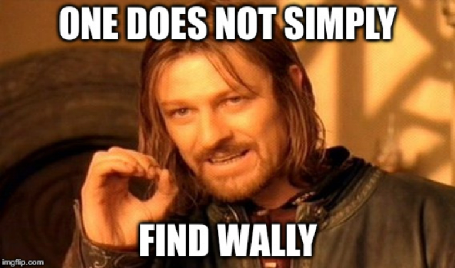

# Cyber Security Challenge 2016: Where's Waldo?

**Category:** Cryptography  
**Points:** 40  
**Challenge designer:** Cédric Bassem  
**Description:**  
> Waldo has really outdone himself this time! [Can you find him?](challenge-source-files/whereswaldo.bpm)  

**Hints:**
> Waldo is well hidden within the image

## Write-up
Waldo is hidden within the above image by using an image steganography technique called LSB steganography. With least significant bits steganography (LSB), data is hidden within an image by altering the least significant bit of each byte. For a BMP file using a 24 bit color representation, each color is represented by three bytes, one for every base color in RGB. Changes in the LSB of every byte have minimal impact on the color and are indiscernible to the human eye.  

One way of detecting LSB steganography is by enhancing the LSB values of that image. The below image shows an LSB enhancement of the above image. We notice the following odd pattern. 


Extracting the information is performed by extracting every LSB value from every color.  
The below python code does this. 

```python
from PIL import Image  
  
im = Image.open("encoded.bmp")  
pix = im.load()  
width, height = im.size  
  
extracted_bits = []  
for y in range(height):  
    for x in range(width):  
	        r, g, b = pix[(x,y)]  
	        extracted_bits.append(r & 1)  
	        extracted_bits.append(g & 1)  
	        extracted_bits.append(b & 1)  
	  
	extracted_byte_bits = [extracted_bits[i:i+8] for i in range(0, len(extracted_bits), 8)]  
	with open("secret.bmp", "wb") as out:  
	    for byte_bits in extracted_byte_bits:  
	                byte_str = ''.join(str(x) for x in byte_bits)  
	        byte = chr(int(byte_str, 2))  
	        out.write(byte)
```

In this case the hidden message was a BMP image



Which contained another LSB hidden image. With FLAG: UHcUbUz5omz5lZKS4pzr


