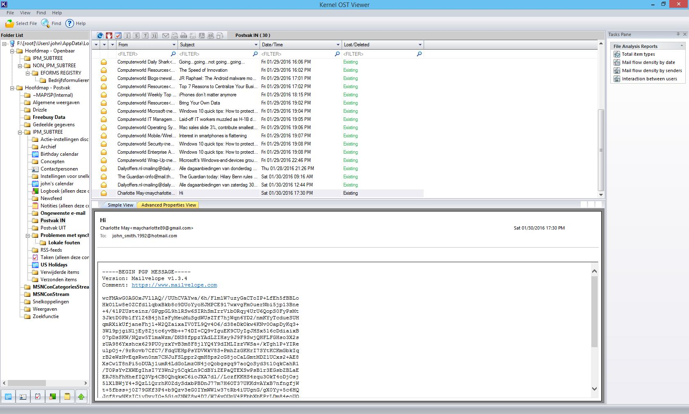
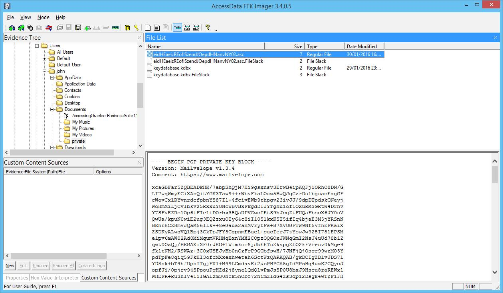
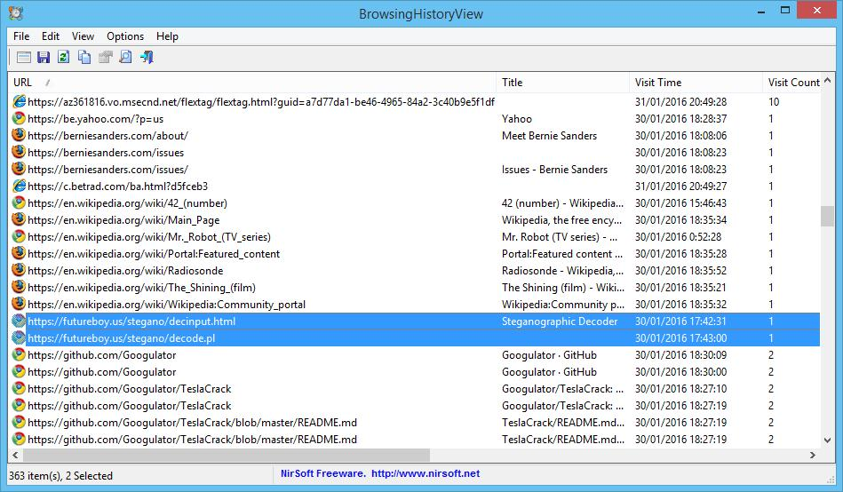
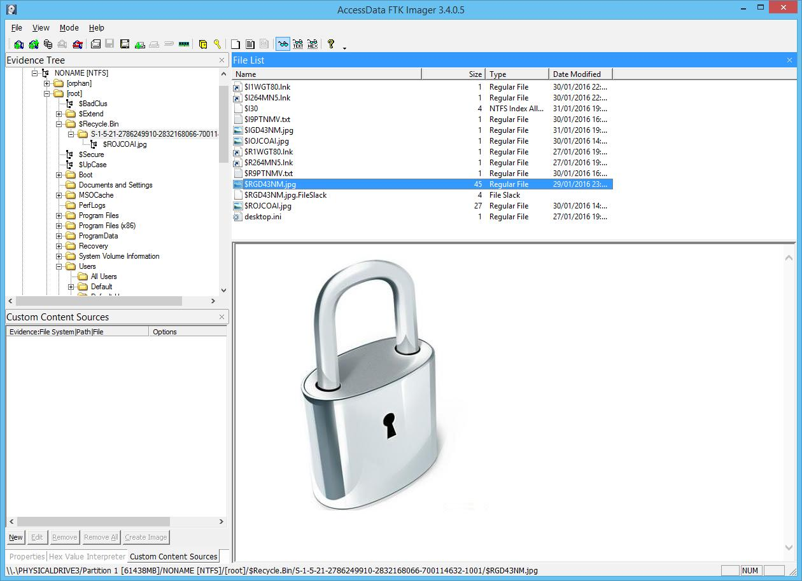
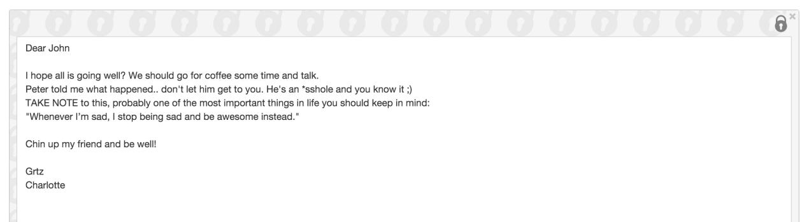

# Cyber Security Challenge 2016: Are you worthy?

**Category:** Digital Forensics  
**Points:** 100  
**Challenge designer:** Sasja Reynaert  
**Description:**  
> An investigation is ongoing on the murder on Peter Hardman. After eyewitnesses mentioned a fight going on between Peter and John Smith, the police took a forensic copy from John Smith’s computer. 
One of his mails confirmed there was a fight between Peter and John, however it didn’t proof John murdered Peter. Show us you are a worthy forensic examiner and give us the advice that was given by mail.

>Hint(s)
>- Find the browsing activity
>- I cleared EVERYTHING!?

[File](https://s3-eu-west-1.amazonaws.com/be.cscbe.challenges/Digital+Forensics+-+Are+you+worthy+-+Sasja+Reynaert/AreYouWorthy.E01) (This file is +8GB)
## Write-up
####Step 1: Find the e-mail
- After mounting the .E01 file, the files can be browsed through. An Outlook Data File (.ost) can be found in the `users\john\appdata\local\microsoft\outlook` folder, the mail to be found is PGP encrypted. Extra investigation is needed to decrypt the file.

####Step 2: Find the private PGP key
A private PGP key is located at `C:\Users\john\Documents\private\eidHEaeizREofISzendJOepdHNanvNY02.asc`. The password is still needed to decrypt the mail. Since we need to find more information to decrypt the mail, extra artifacts must be investigated.

####Step 3: Investigate browser history
In the Google Chrome browser history there are traces of searches to steganography. The two sites that are of interest are:

- https://futureboy.us/stegano/decinput.html
- https://futureboy.us/stegano/decode.pl

####Step 4: Find the image with hidden information
In the Recycle.Bin folder there are a few deleted files. With e.g. FTK, an image called $RGD43NM.jpg can be found. The name of the file can be seen with the RecBin tool (locked.jpg). Once decoded with the above mentioned sites, it will give the password to decrypt the PGP encrypted mail which was found earlier.
password: this_is_definitely_not_the_password_you_are_looking_for

####Step 5: Decrypt the PGP encrypted e-mail
With the mailvelope plugin in Chrome or Firefox it is easy to import the private key and decrypt the e-mail without the need of additional tools.
The solution to this challenge is: “Whenever I’m sad, I stop being sad and be awesome instead.” (without quotes)

##Solution
"Whenever I’m sad, I stop being sad and be awesome instead."

## Other write-ups and resources

