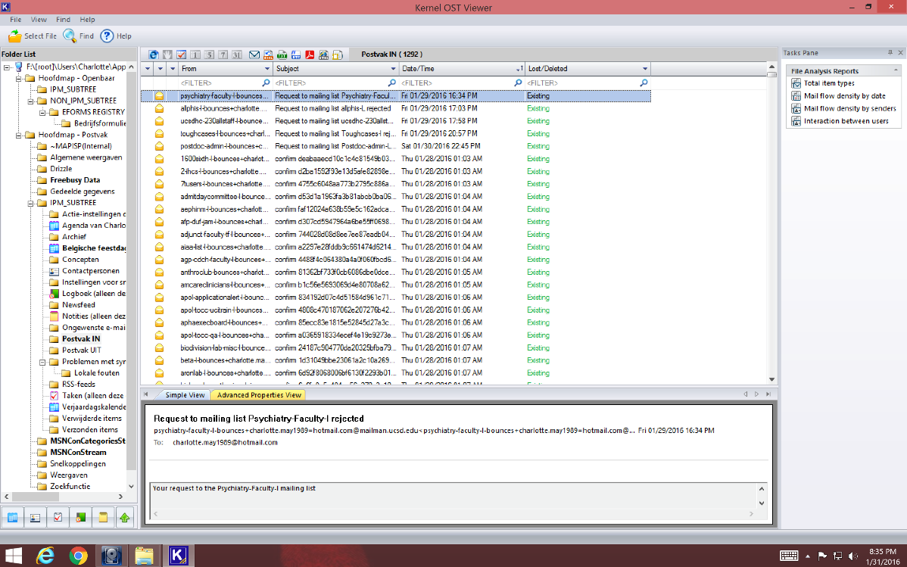
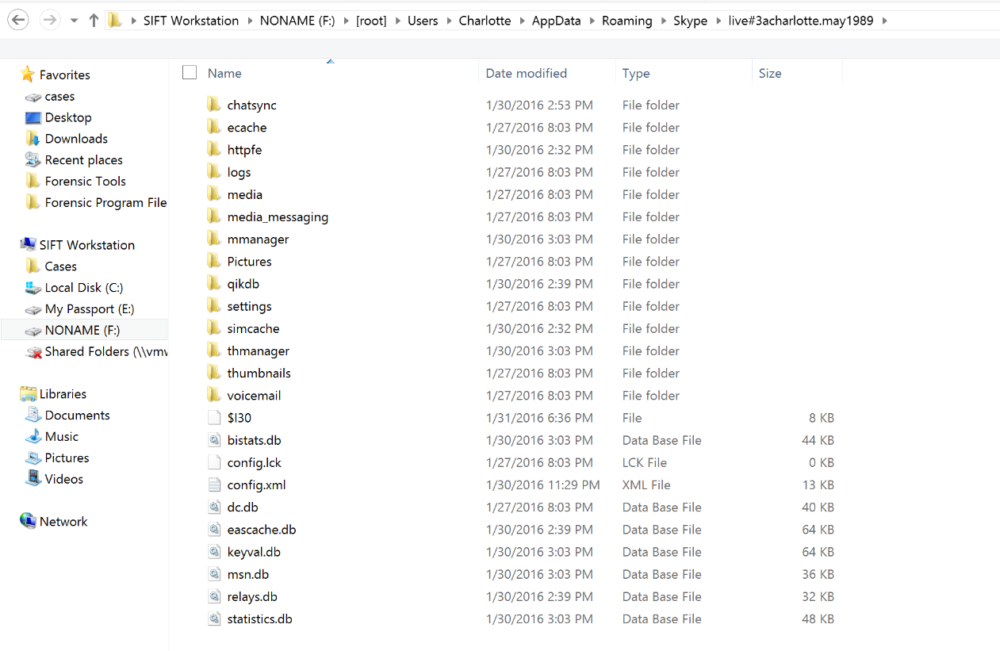
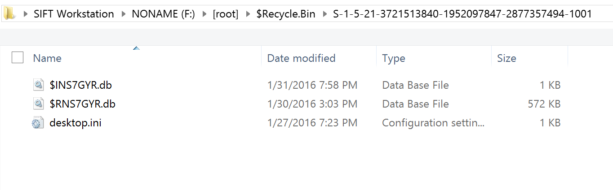
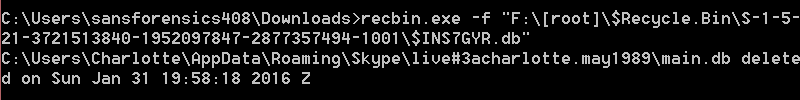
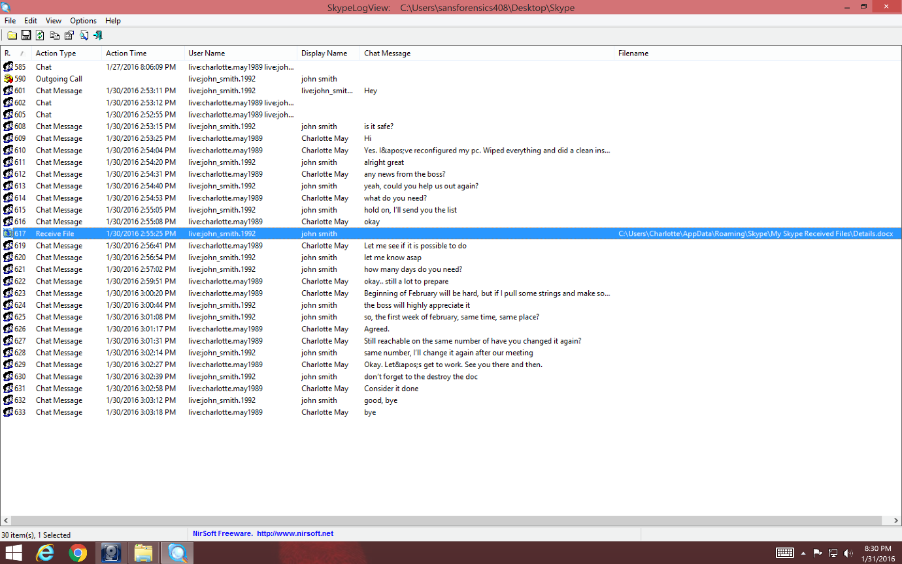
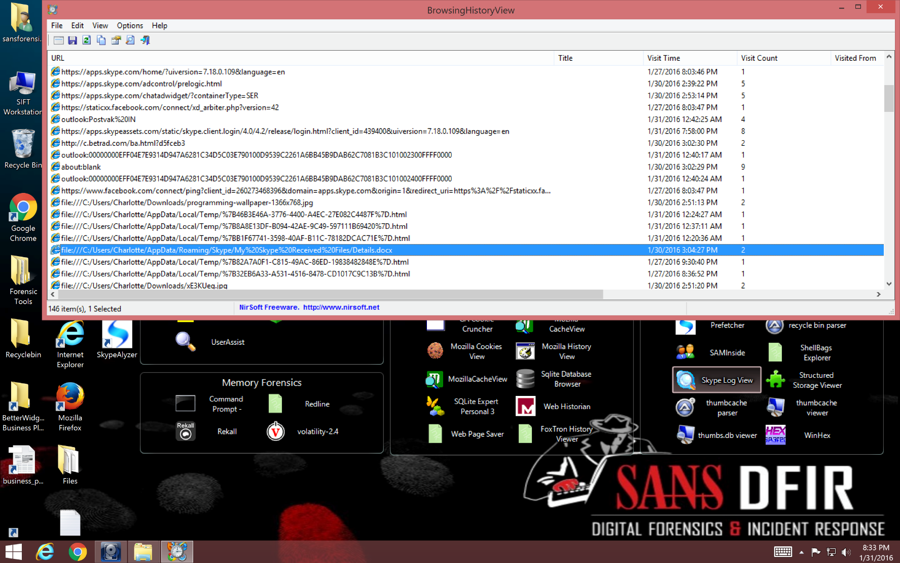

# Cyber Security Challenge 2016: Caught before the drug deal

**Category:** Digital Forensics   
**Points:** 100  
**Challenge designer:** Annika ten Velden  
**Description:**  
> During a raid of the police as an attempt to catch a huge narcotics gang, the police confiscated a computer of Charlotte May. She is suspected of helping setting up different drug deals. 
Communication found on this computer proved the existence of a next drug transfer. Can you find the transfer code of the next deal?

[File Here](https://s3-eu-west-1.amazonaws.com/be.cscbe.challenges/Digital+Forensics+-+Caught+before+drug+deal+-+Annika+ten+Velden/CaughtBeforeDrugDeal.E01) (9GB)

>Hints:

> - E-mail is not the only communication type existing
> - When a file gets deleted, some parts remain visible on a system

## Write-up
- Step 1 - mounting the e01 file with e.g. FTK imager  
A first examination of the image shows the computer is recently installed. Not a lot of files are found on it and only a few applications are installed. At first sight we see that there are a few possibilities to communicate with other people: Outlook, Internet, TeamViewer and Skype.

- Step 2 - going through e-mail  
In the Users\Charlotte\AppData\Local\Microsoft\Outlook folder we see an .ost file of Charlotte May. Opening this file with eg. Kernel OST viewer shows us a lot of mails. Going through the mails, all mail seems to be subscription requests and cancellations. No e-mail with real conversation was found.

- Step 3 – going through Skype history  
When looking in Users\Charlotte\AppData\Roaming\Skype\live#3acharlotte.may1989 no main.db file was found.

The main.db is the database where all Skype history is kept. When exploring the recycle bin we see that there is a .db file. When viewing this with RecBin, it shows that this was a deleted main.db file. After recovering the deleted file and renaming it to main.db, it is possible to read it with eg. SkypeLogView.

When looking at the recovered Skype history a conversation was found between Charlotte and John about a deal that is held in February. John sends a file, called Details.docx, to Charlotte with the details of it. Charlotte also confirms the file will be destroyed after reading it.

- Step 4 – examining browser history  
Examining browser history of the installed browsers shows that some browsing was done. A local file, called Detailed.docx can be found that was located in the Skype Received Files folder.

- Step 5 – finding the file  
The folder where the Details.docx file was located, seemed to be cleared. We also see that sdelete.exe and CCleaner.exe was downloaded which seems to be an indicator that the file was securely wiped.  
A good forensic examiner does not give up this quickly, but thinks about where information could still exist. Based on this, looking at the thumbcache can maybe be helpful.  

Opening the Users\Charlotte\AppData\Local\Microsoft\Windows\Explorer\thumbcache_256.db shows different thumbnails. A thumbnail of a Word document was found where we can see “Confidential” written on the page. Below the “Confidential” we can read the transfer code “T162-BE8829/BRU9102883” which is the solution to this challenge.

##Solution
T162-BE8829/BRU9102883
## Other write-ups and resources

