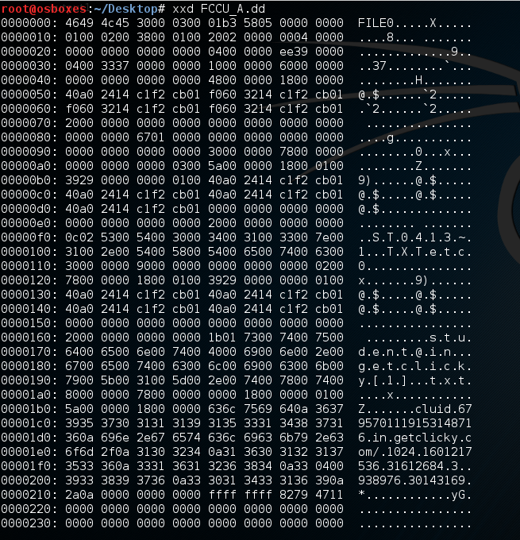

# Cyber Security Challenge 2016: Only 2 sectors can lead to a criminal

**Category:** Digital Forensics  
**Points:** 60  
**Challenge designer:** Yves Vandermeer  
**Description:**  
> Analyse provided NTFS MFT record and compute MD5 checksum for the file content.

[File Here](challenge-source-files/FCCU_A.dd)

>Hint: You want the flag but you can’t seem to get it, maybe you need a fixup?

## Write-up
- Note that all values read in a NTFS MFT record are little endian encoded.
- Looking to the provided file with xdd command, we can see “FILE” in the header. This means the file is an NTFS MFT record.

- As we are looking for file content, we have to locate $DATA attribute. A $DATA attribute is always starting with byte sequence 0x 80 00 00 00 then followed by a DWord for the attribute length (little endian)
- We can identify the $DATA attribute at offset 416 (0x01A0) and the attribute length is 120 bytes (0x00000078).
- Byte at offset 0x08 relative to the attribute is used to indicate if the file content is non resident (0x01) or resident (0x00). In this case the value is 0x00, meaning that the content is resident, included into the MFT record
- Offset 0x10 relative to the attribute indicate the length of content ( 4 bytes) and offset 0x14 indicate the offset of content into the attribute ( 4 bytes). In this case resident file content start at offset 0x18 + 0x01A0, 0X1B8 and is 90 bytes length (0x5A).
- Before extracting content, we have to be aware that for “security reasons” NTFS replace every 510 and 511 bytes of each MFT record sector by using a so called “fixed array” of values. At MFT record offset 0x04 a word point to the fixed array (0x30 here) , immediately followed at offset 0x06 by a word describing how many 2 byte entries are in the array (in this case 0x03)
- Thus, we need to replace the bytes 510 and 512 by the first “real value” in the fixed array.
- Fixed array starts at 0x30 with the “fixed 2 byte mask”, equal to the bytes stored so fat at offsets 510 and 511 : “04 00”. They need to be replaced by first 2 byte entry: “33 37”. 
- It is now time to extract file content (90 bytes from offset 0x1B8) into a real text file and to compute hash value to get the solution.

##Solution
1fc720433f6eca2e298f65efec695aaa

## Other write-ups and resources
