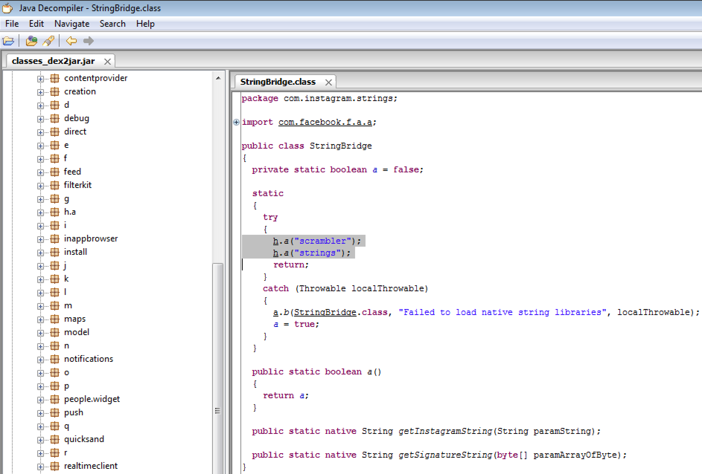
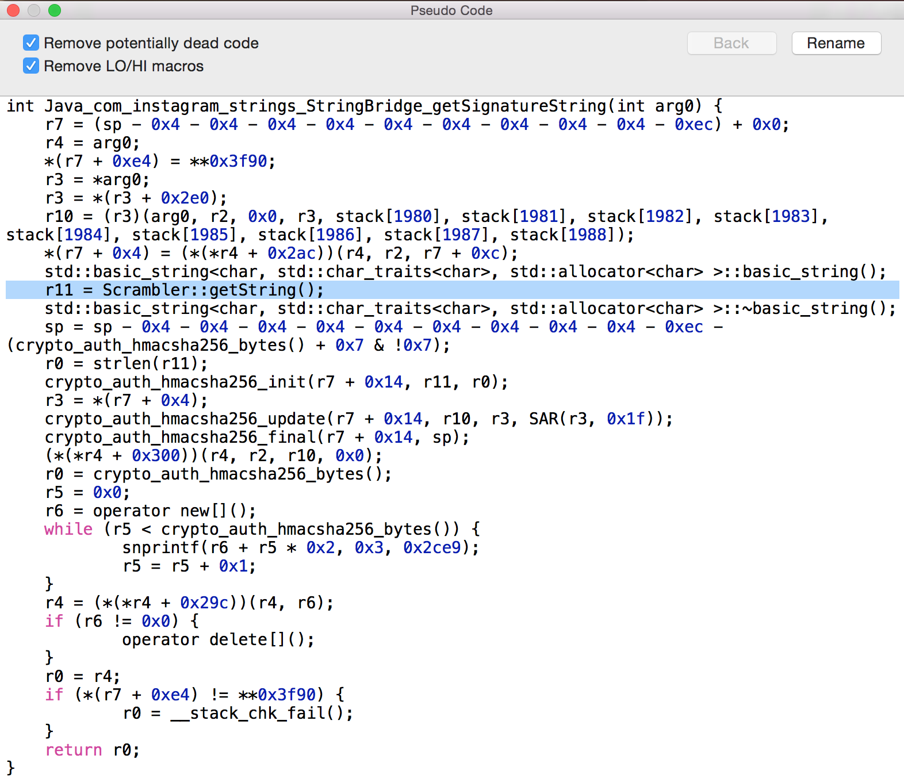

# Cyber Security Challenge 2016: Phishing is not a crime

**Category:** Mobile Security  
**Points:** 50  
**Challenge designer:** Arne Swinnen  
**Description:**
> Can you phish the key that the Instagram for Android mobile application APK v7.9.0 is using to sign outgoing JSON data in the signed_body POST parameter? 
> 
> Hint: I love my scrambled egg in the morning!

[Application file](https://github.com/NVISO-BE/CSCBE2016-Challenge-Writeups/blob/master/Mobile%20Security/Phishing-is-not-a-crime/challenge-source-files/com.instagram.android_7.9.0-16288123_minAPI14.apk)

## Write-up
Visiting the author's latest blogpost highlights the method he took in the past to extract the key: https://www.arneswinnen.net/2016/02/the-tales-of-a-bug-bounty-hunter-10-interesting-vulnerabilities-in-instagram/
- Unzip the APK, Dex2jar the embedded “classes.dex” file and decompile the resulting JAR back to java code:
```
$ unzip -d instagram_apk com.instagram.android_7.9.0-16288123_minAPI14\(armeabi-v7a\)\(nodpi\).apk
Archive:  com.instagram.android_7.9.0-16288123_minAPI14(armeabi-v7a)(nodpi).apk
    inflating: instagram_apk/META-INF/MANIFEST.MF  
    inflating: instagram_apk/AndroidManifest.xml  
    inflating: instagram_apk/LICENSE.txt  
    inflating: instagram_apk/META-INF/CERT.RSA  
    (…)
$ dex2jar classes.dex 
    this cmd is deprecated, use the d2j-dex2jar if possible
    dex2jar version: translator-0.0.9.15
    dex2jar classes.dex -> classes_dex2jar.jar
    Done.
```
- Decompiling the jar with the JD-GUI tool and searching for the string “Signature” yields an interesting result:




- We can see the function getSignatureString(byte[]), which is implemented by a native library. Meanwhile, two native libraries are loaded by the same class, “scrambler” and “strings”. Disassembling the strings library (/lib/armeabi-v7a/libstrings.so) in Hopper tells us this is the library which implements this function (decompiled to pseudo code):



- The key for the signature algorithm (HMACSHA256) is fetched via the method Scrambler::getstring(). Decompiling this method reveals that the key is generated dynamically:


- We cannot simply copy paste it from here. However, we now know where the function that returns the signature key is located. All that is left is to hook this function’s return value upon calling, e.g. via the following Frida hooking code in python:

```python
import frida
import sys
 
session = frida.get_usb_device(1000000).attach("com.instagram.android")
script = session.create_script("""
fscrambler = Module.findExportByName(null,"_ZN9Scrambler9getStringESs");
Interceptor.attach(ptr(fscrambler), {
   onLeave: function (retval) {
​​send("key: " + Memory.readCString(retval));
   }
});
""")
 
def on_message(message, data):
   print(message)
   
script.on('message', on_message)
script.load()
sys.stdin.read()
```

- Starting the frida-server on the USB-attached mobile testing device, launching Instagram, executing the python script and triggering a calculation of a signature via e.g. a false login attempt spits out the key:

```
$ adb shell
shell@mako:/ $ su
root@mako:/ # /data/local/tmp/frida-server &                                  
[1] 3354
root@mako:/ # exit
shell@mako:/ $ exit
$ python hook.py
{u'type': u'send', u'payload': u'key: 4d53d9e2da15fd018e591939cd9689a8e7bbed50841fcb35b976ce63461cb834'}
```

## Solution
4d53d9e2da15fd018e591939cd9689a8e7bbed50841fcb35b976ce63461cb834

## Other write-ups and resources
- None yet.
