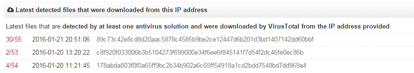

# Cyber Security Challenge 2016: Find Me

**Category:** OSINT  
**Points:** 25  
**Author:** Vasileios Friligkos
**Description:**
> Bad news @dayjob!
A user has been infected and you need to provide some information about the malware to your CISO asap.
Access to the logs is taking too long and all you have is a URL (proequilibrium dot com).

>Can you take a shot and say what the malware probably is?
(Anti malware vendors tend to use different names, the name we’re looking for is the one used by malwarebytes)

>Hint: If the URL doesn't give any results, how about the IP?

## Write-up
So all we have is a URL: proequilibrium[.]com and we need to guess the malware.
What better way to take a chance than googling it.
 
Ok, not much..
Let’s add some keywords like malware, infection
.. still not much.
 
Well, sometimes the URL may not match with an existing analysis but the IP does.
Resolving the URL gives us the IP: 198.173.254.216
 
Googling about the IP and some relative keywords gives us a virustotal link:
 
https://www.virustotal.com/en/ip-address/198.173.254.216/information/
 
and bingo! Malware files that were downloaded from this IP:

Last thing to do is click on the first file to see the details, and find the MalwareByte entry.

## Solution
Trojan.Dridex
## Other write-ups and resources
- None yet.
