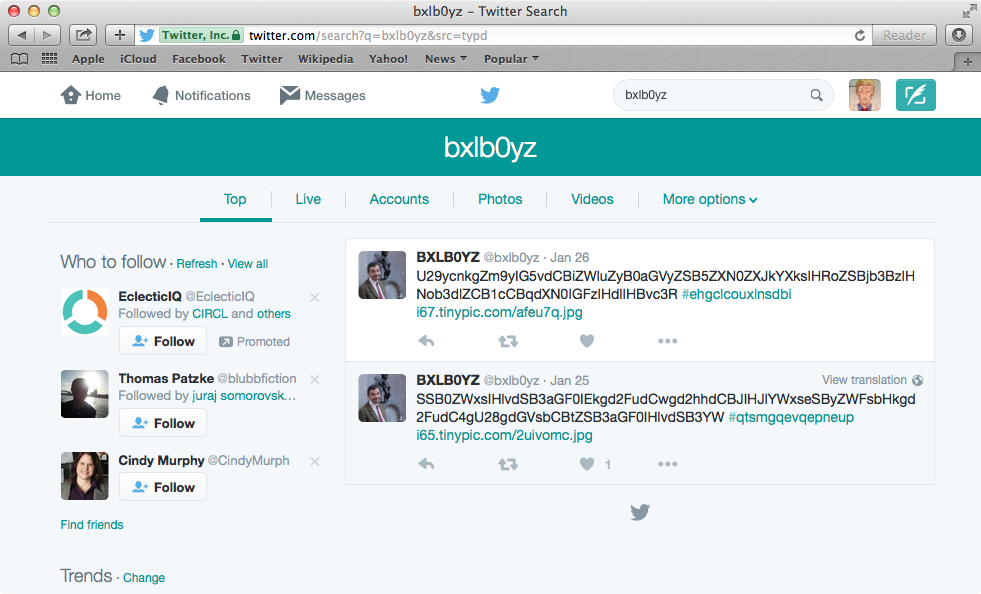
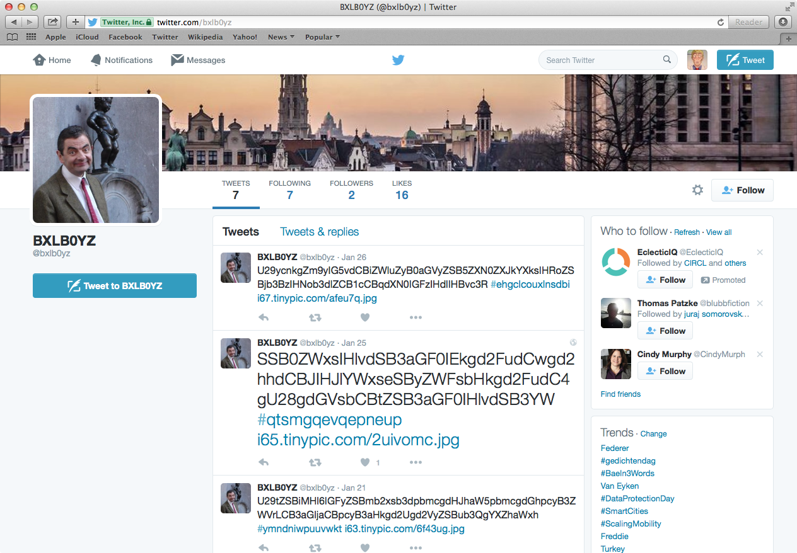
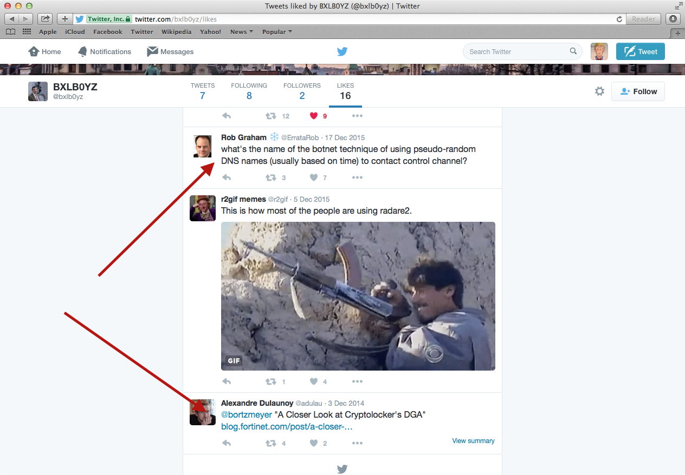
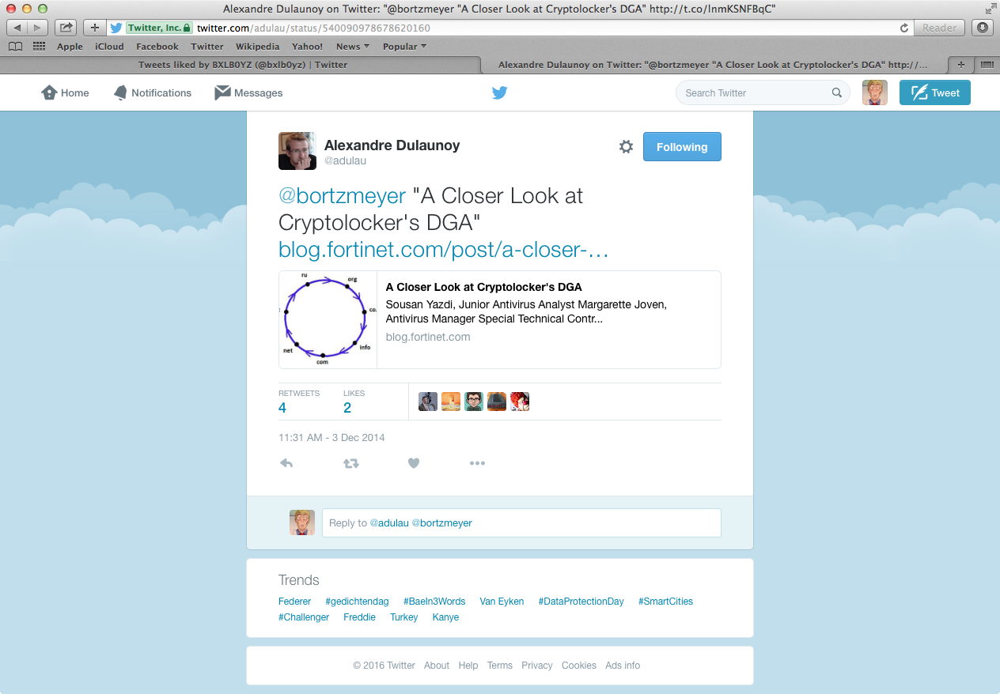
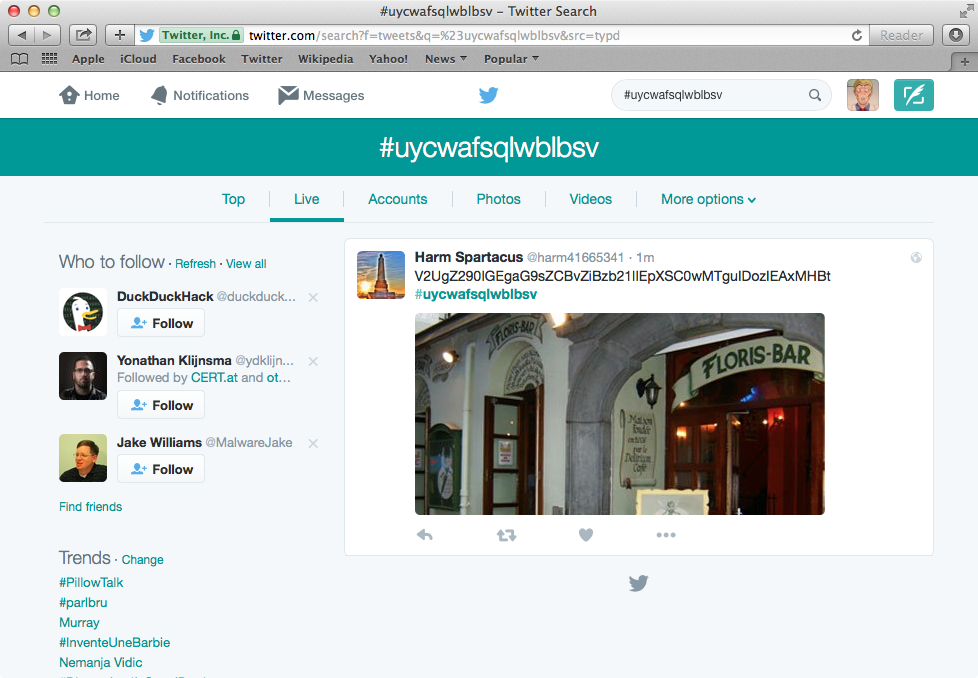
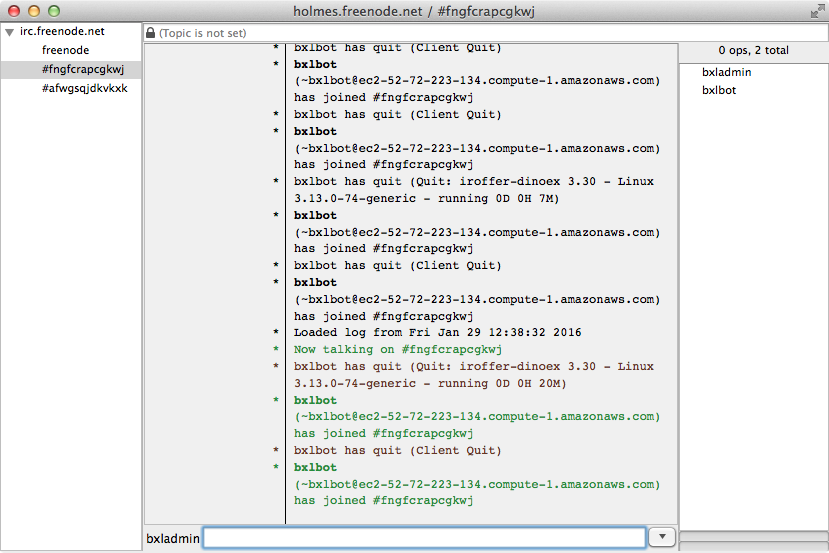
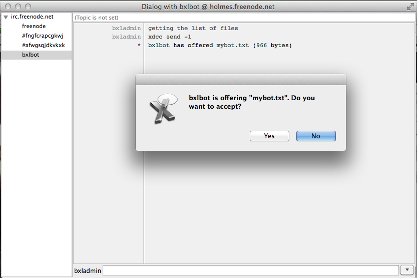
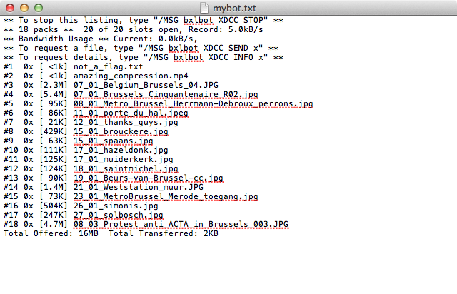
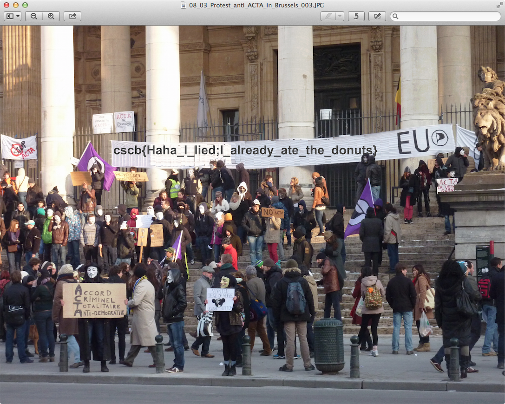

# Cyber Security Challenge 2016: Bxlb0yz

**Category:** OSINT  
**Points:** 100  
**Challenge designer:** Adriaan Dens  
**Description:**  
> There seems to be a new gang of youngsters in BXL city, selling pharmaceuticals and designer drugs. Being a young hipster gang, not a moment goes by without them checking their smartphone and updating their online profiles.  Sadly, as an old police officer, I cannot follow their every move on all these social things online. So I need you to go online and crack the case for me. There are donuts at the end!

>Hint: 32-bit

##Write-up

Note: The tweets you see in this writeup will probably be different as the feed remains active until just before the challenge. We also tried to keep a low profile in the months before the competition, such that the Twitter account would not be found. As such, the number of likes, followers etc. will be higher when you solved it as to when this write-up was written.


### Finding the Twitter account

The first step was to find the Twitter account. As a small hint, we gave away that they were active on social media. Using the Twitter search function yields the account:



Of course, Google also lists this Twitter account when searching for "bxlb0yz".

As we take a look at the Twitter account that we found, we notice the strange use of hashtags:




### Finding the logic behind the hashtag

Of course, somewhere is a clue hidden about the logic behind those hashtags. There are a few candidates. We can take a look at the pictures in the tweets, we can search for interesting people that the account follows and we can look at the likes given by the account.

With some searching, you would find that a hint was given in the likes. There are a number of likes that talk about DGAs (Domain Generated Algorithms) and some that talk about Cryptolocker, which uses DGAs.



The most interesting tweet is from Alexandre Dulaunoy:



### Writing an implementation of the DGA

Using the link provided (http://blog.fortinet.com/post/a-closer-look-at-cryptolocker-s-dga), we implement the DGA:

```c
#include<stdio.h>
#include<stdlib.h>
#include<inttypes.h>

uint32_t generate_key(uint32_t);
char* generate_hashtag(uint32_t, uint32_t, uint32_t, uint32_t);

int main() {
	uint32_t initial_seed = 0;
	uint32_t key = generate_key(initial_seed);
	uint32_t year = 2016;
    for(uint32_t month = 1; month < 4; month++) {
        for(uint32_t day = 1; day < 32; day++) {
            char* hashtag = generate_hashtag(key, day, month, year);
            printf("%" PRIu32 "/%" PRIu32 "/2016: #%s\n", day, month, hashtag);
            free(hashtag);
        }
    }
	return 0;
}

char* generate_hashtag(uint32_t key, uint32_t day, uint32_t month, uint32_t year) {
    /* Generating new_key */
    uint32_t new_key = (((key * 0x10624DD3) >> 6) * 0xFFFFFC18) + key;

    /* Current day */
    uint32_t day_key = (day << 0x10) ^ day;
    if(day_key <= 1) {
        day_key = day << 0x18;
    }

    /* Current month */
    uint32_t month_key = (month << 0x10) ^ month;
    if(month_key <= 7) {
        month_key = month << 0x18;
        if(month_key <= 7) {
            month_key = ~month_key;
        }
    }

    /* Current year */
    uint32_t year_key = ((year + new_key) << 0x10) ^ (year + new_key);
    if(year_key <= 0xF) {
        year_key = ((year + new_key) << 0x18);
    }

    /* String length */
    uint32_t string_length = (((day_key ^ ((year_key ^ 8 * year_key ^ ((day_key ^ ((month_key ^ 4 * month_key) >> 6)) >> 8)) >> 5)) >> 6) & 3) + 0xC;

    /* Generating the name */
    uint32_t index = 0;
    char* servername = calloc(string_length+1, sizeof(char));
    servername[string_length] = '\x00';
    do {
        day_key = (day_key >> 0x13) ^ ((day_key >> 6) ^ (day_key << 0xC)) & 0x1FFF ^ (day_key << 0xC);
        month_key = ((month_key ^ 4 * month_key) >> 0x19) ^ 0x10 * (month_key & 0xFFFFFFF8);
        year_key = ((year_key ^ 8 * year_key) >> 0xB) ^((year_key & 0xFFFFFFF0) << 0x11);
        index++;
        servername[index-1] = (day_key ^ month_key ^ year_key) % 0x19 + 'a';
    } while(index < string_length);

    return servername;
}

uint32_t generate_key(uint32_t seed) {
    /* Stage 2: Generating the array of seeds */
    uint32_t seed_array[624];
    seed_array[0] = seed;
    for(int i = 1; i < 624; i++) {
        uint32_t previous_seed = seed_array[i - 1];
        uint32_t current_seed = (((previous_seed >> 0x1E) ^ previous_seed) * 0x6c078965) + i;
        seed_array[i] = current_seed;
    }
    
    /* Stage 3: Processing the array of seeds */
    int i = 0;
    while(i < 0xE3) {
        uint32_t seed_a = seed_array[i];
        uint32_t seed_b = seed_array[i + 1];
        uint32_t temp_a = (seed_a ^ seed_b) & 0x7FFFFFFF;
        i++;
        temp_a = (temp_a ^ seed_a) & 1;
        uint32_t consta[] = {0, 0x9908B0DF};
        temp_a = ((temp_a >> 1) ^ consta[0+(temp_a & 1)]) ^ seed_array[0x18C+i];

        seed_array[i - 1] = temp_a;
    }

    /* Stage 4: Computing the DWORD value */
    uint32_t temp_b = seed_array[1];
    temp_b = ((((temp_b >> 0xB) ^ temp_b) & 0xFF3A58AD) << 0x7) ^ (temp_b >> 0xB) ^ temp_b;
    uint32_t temp_c = ((temp_b & 0xFFFFDF8C) << 0xF) ^ temp_b;
    uint32_t key = temp_c ^ (temp_c >> 0x12);

    return key;
}

```

Note that we do not have to implement the iteration of a thousand domains, since the bxlb0yz use the first one.


And we get:

```
$ gcc -std=c99 -o bxlb0yz_DGA bxlb0yz_DGA.c 
$ ./bxlb0yz_DGA
1/1/2016: #htigwhmqwphp
2/1/2016: #ugmjynldrgbh
3/1/2016: #anaihgipbdbu
4/1/2016: #grkqejcphtvc
5/1/2016: #lyxpmcyupmyv
6/1/2016: #ylcsoixsotql
7/1/2016: #esprwbufayuj
8/1/2016: #xxnbadraiyysp
9/1/2016: #dgwajeiuavyro
10/1/2016: #qrcpmyohkauoq
11/1/2016: #valovafuyktjp
12/1/2016: #cddkpxebmlifh
13/1/2016: #hlmjyyuvgqmov
14/1/2016: #uwryctbtulgji
15/1/2016: #afbxlurhlejow
16/1/2016: #paqtlblmhphgqo
17/1/2016: #uhesttirnagpnd
18/1/2016: #ivqvxqlqftcpwq
19/1/2016: #ndeugjidoqcdtw
20/1/2016: #tfaefpakmcsdxp
21/1/2016: #ymndniwpuuvwkt
22/1/2016: #mbagrfadehleef
23/1/2016: #rinfaxwppmpcqb
24/1/2016: #lljnwpnbyhpofcp
25/1/2016: #qtsmgqevqepneup
26/1/2016: #ehgclcouxlnsdbi
27/1/2016: #jppbudfimvmnccp
28/1/2016: #pqsxqecvrrwcmei
29/1/2016: #uycwafsqlwblbsv
30/1/2016: #impmfqdekwsxkqd
31/1/2016: #nuylortrbpvdynx
1/2/2016: #ikvbakhjcjcf
2/2/2016: #vienjusowhys
3/2/2016: #bprmsnpkgavg
4/2/2016: #hpeesewudpmt
5/2/2016: #mwrdcwtjldsn
6/2/2016: #auaplhfakthy
7/2/2016: #fcnouacvvuow
8/2/2016: #yobhdwnsuiwlc
9/2/2016: #ewkglxeembtky
10/2/2016: #rttfxwxcwmsdn
11/2/2016: #wcdegxoglroxk
12/2/2016: #dbwjfjappvyat
13/2/2016: #ijginkqbjwgjg
14/2/2016: #vgphajkkxbwaf
15/2/2016: #boygikbooodfr
16/2/2016: #qqelpljxbnjslf
17/2/2016: #vxrkyegmhsfcks
18/2/2016: #jxiwgfvayvexha
19/2/2016: #ofvvpxsvioblgf
20/2/2016: #udtovrxrwyvrsh
21/2/2016: #akhnfkugfmclhk
22/2/2016: #nkxamlkiogooop
23/2/2016: #srlyveheahvmdk
24/2/2016: #mcwqcqmvaprxnkv
25/2/2016: #rkgpkrdhriowkej
26/2/2016: #fjxouhbnyypxeqw
27/2/2016: #krhndirrnelsbsr
28/2/2016: #qomtiwbmjdanunb
29/2/2016: #vwvsqxrxdehwhdb
30/2/2016: #jvnrbnpsclvflhn
31/2/2016: #oewqjogwsyckxfu
1/3/2016: #jbrlpurtrosu
2/3/2016: #wyvotbdamvmi
3/3/2016: #cgjnctauvgmv
4/3/2016: #iyaojohkcehh
5/3/2016: #ngnnrhexkjkb
6/3/2016: #berqvnppjhcm
7/3/2016: #glfpegmkuagk
8/3/2016: #afwgsqjdkvkxk
9/3/2016: #fngfcrapcgkwj
```

### Getting to the other accounts

Now what can we do with these hashtags? What about searching for them?



Note: This can be automated by using the Twitter Search API. (See below)

In the end, you will end up with 4 twitter accounts that post tweets with those hashtags.

 - @bxlb0yz: We already knew this one
 - @brux90951178
 - @harm41665341
 - @willy36346227

From all these accounts, we can put together a story. Let us have a closer look at the latest tweets from every account.

### Final messages on Twitter

If you decode the latest Twitter messages, you will figure out that they have problems with a rival gang and that they decide to change their way of communicating with customers.

From the final messages, we find that they are talking about the FreeNode IRC.

 * @harm41665341: "# is not only for hashtags" ----> Implies other channel also using the pound symbol
 * @willy36346227 has followed @freenodestaff.
 * @brux90951178: "0x1A0B 0x1A0C 0x1A0D 0x1A29 #node #free"

Where the hexidecimal numbers are pointers to the frequently used IRC ports.

### Going onto IRC

So we know that they are somewhere on the Freenode IRC, but we do not know the name of their channel. What about reusing those hashtags as channel names?

Oh look, there are some people in the channel:



The user 'bxlbot' seems interesting.

### Getting the file from the bot

If you know XDCC bots on IRC then you are essentially done at this point. If not, you might had to troubleshoot a bit by talking to the bot or research available bot software.

```
/msg bxlbot xdcc send -1
```



Open file:



Start downloading the files...

```
/msg bxlbot xdcc send 1
/msg bxlbot xdcc send 2
/msg bxlbot xdcc send 3
...
/msg bxlbot xdcc send 18 
```

Looking at the files, we find a particulary interesting one...



### Flag

cscb{Haha_I_lied;I_already_ate_the_donuts}


### Automating searching on Twitter

```python
from TwitterSearch import *
import time

hashtags = ["#htigwhmqwphp", "#ugmjynldrgbh", "#anaihgipbdbu", "#grkqejcphtvc", "#lyxpmcyupmyv", "#ylcsoixsotql", "#esprwbufayuj", "#xxnbadraiyysp", "#dgwajeiuavyro", "#qrcpmyohkauoq", "#valovafuyktjp", "#cddkpxebmlifh", "#hlmjyyuvgqmov", "#uwryctbtulgji", "#afbxlurhlejow", "#paqtlblmhphgqo", "#uhesttirnagpnd", "#ivqvxqlqftcpwq", "#ndeugjidoqcdtw", "#tfaefpakmcsdxp", "#ymndniwpuuvwkt", "#mbagrfadehleef", "#rinfaxwppmpcqb", "#lljnwpnbyhpofcp", "#qtsmgqevqepneup", "#ehgclcouxlnsdbi", "#jppbudfimvmnccp", "#pqsxqecvrrwcmei","#uycwafsqlwblbsv", "#impmfqdekwsxkqd", "#nuylortrbpvdynx", "#ikvbakhjcjcf", "#vienjusowhys", "#bprmsnpkgavg", "#hpeesewudpmt", "#mwrdcwtjldsn", "#auaplhfakthy", "#fcnouacvvuow", "#yobhdwnsuiwlc", "#ewkglxeembtky", "#rttfxwxcwmsdn", "#wcdegxoglroxk", "#dbwjfjappvyat", "#ijginkqbjwgjg", "#vgphajkkxbwaf", "#boygikbooodfr", "#qqelpljxbnjslf"]
try:
    for hashtag in hashtags:
        tso = TwitterSearchOrder()
        print "Searching for %s" % hashtag
        tso.add_keyword(hashtag)

        ts = TwitterSearch(
            consumer_key = 'nya~~~~~~n',
            consumer_secret = 'Twitter is so 2010',
            access_token = 'plz give me t0ken',
            access_token_secret = 'sikrit access tokens are sikrit'
         )

        for tweet in ts.search_tweets_iterable(tso):
            print( '@%s tweeted: %s' % ( tweet['user']['screen_name'], tweet['text'] ) )

        time.sleep(5) # flipping rate-limit

except TwitterSearchException as e:
    print(e)
```

```bash
$ python sol.py 
...
Searching for #qqelpljxbnjslf
@brux90951178 tweeted: RG9uJ3QgZm9yZ2V0IHRvIHBhc3MgYnkgdG8gZ2V0IGFuIHVwZGF0ZSBvbiBvdXIgbmV3IHdheSBvZiBjb21tdW5pY2F0aW5nOy #qqelpljxbnjslf https://t.co/I11KDkdxNC
@brux90951178 tweeted: MHgxQTBCIDB4MUEwQyAweDFBMEQgMHgxQTI5ICNub2RlICNmcmVl #qqelpljxbnjslf
Searching for #boygikbooodfr
@harm41665341 tweeted: QmUgc3VyZSB0byBwYXNzIGJ5IHRoaXMgd2VlayB0byBrbm93IHdoZXJlIHdlJ3JlIGdvaW5n #boygikbooodfr https://t.co/vGu8Qf26oO
Searching for #vgphajkkxbwaf
@bxlb0yz tweeted: QnV5IGEgbmljZSBnaWZ0IGZvciB5b3VyIGdpcmwvYm95ZnJpZW5kIHRvZGF5ISAyMCUgMEZGIQ== #vgphajkkxbwaf https://t.co/rUAUayxvIf
@bxlb0yz tweeted: T3VyIGIweXogd2lsbCBsZWF2ZSBoaW50cyBvbiBUd2l0dGVyIG5leHQgd2VlayBhYm91dCBvdXIgbmV3IGNoYW5uZWwhIE9yIGp1c3QgY29tZSB2aXNpdCB1cw== #vgphajkkxbwaf
@bxlb0yz tweeted: V2UgaGF2ZSBkZWNpZGVkIHRvIGNoYW5nZSB0aGUgbWVkaXVtIG9uIHdoaWNoIHdlIGNvbW11bmljYXRlLiBXZSB3aWxsIHN3aXRjaCBuZXh0IHdlZWsu #vgphajkkxbwaf
Searching for #ijginkqbjwgjg
@willy36346227 tweeted: V2UgYXJlIG5vdyBtZWV0aW5nIHVwIHNpbmNlIHdlIGhhdmUgaGFkIHRoaXMgJ3Byb2JsZW0nIGZvciBhIGZldyBkYXlzIG5vdy4gTm90aGluZyB0b25pZ2h0Lg== #ijginkqbjwgjg
Searching for #dbwjfjappvyat
@brux90951178 tweeted: QmFkIGx1Y2s/IEkgdGhpbmsgbm90LiBTb3JyeSBmb3IgaGF2aW5nIHRvIGxlYXZlIGFnYWluIGFmdGVyIDEwbWluLg== #dbwjfjappvyat https://t.co/FZnoOkJUB8
Searching for #wcdegxoglroxk
@harm41665341 tweeted: U29ycnkgZm9yIG9ubHkgYmVpbmcgdGhlcmUgZm9yIDE1bWluLCB5ZXN0ZXJkYXkuIE91ciAnYnVkZGllcycgc2hvd2 #wcdegxoglroxk https://t.co/tDpUgku6LI
Searching for #rttfxwxcwmsdn
@willy36346227 tweeted: QmVzaWRlcyB0aGUgbm9ybWFsIHN0dWZmLCB3ZSBub3cgYWxzbyBoYXZlIGEgc3VwcGx5IG9mIExlZ2FsIFguIFNlZSB5 #rttfxwxcwmsdn https://t.co/Ax6PrwLvJ9
....
```
