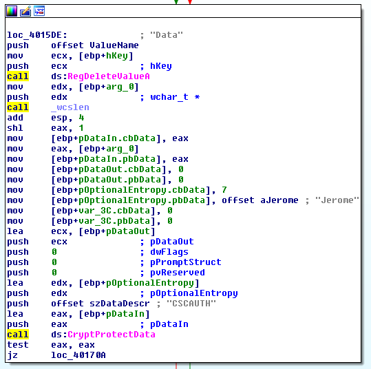

# Cyber Security Challenge 2016: Csc Mainframe


**Category:** Reverse Engineering  
**Points:** 120  
**Challenge designer:** Jerome Kleinen  
**Description:**  
> Goddamnit. Not only have I lost my Windows password but I also can’t remember my credentials for the CSC mainframe. I still have the application that encrypted my mainframe password, but it’s locked within the VM. Can you help me?

[File Here](https://s3-eu-west-1.amazonaws.com/be.cscbe.challenges/Reverse+Engineering+-+CSC+Mainframe+-+Jerome+Kleinen/CSC_2016_JK_v2.7z)

>Hints: 
>- For the VM: if you rebooted the VM, you might need to extract it again.
>- For the application: have a look at the API used to encrypt the flag. You might need to use a debugger to get all the parameters just right.

## Write-up
There are two parts to this challenge:

####1) Gaining access to the VM

You need to open the VM in VirtualBox. You will need to make a memory image of the current snapshot. There are several ways to do this (see http://wiki.yobi.be/wiki/RAM_analysis from a fellow Belgian security researcher), but this way works best:

- From a command prompt, run the following command (add virtualbox to Path):

`virtualbox --dbg --startvm “CSC”`

- Click debug -> command line and enter .pgmphystofile win8_locked.raw

- convert the memory image to a crashdump file using volatility:

`volatility -f win8_locked.raw --profile=Win8SP0x86 raw2dmp -O win8_locked.dmp`

- Load the crash dump into Windbg x86 (I think this has to be the 32 bit version of Windbg)

- Enter the following commands in windbg:

```
.symfix

.reload

!process 0 0 lsass.exe
```

- This will give you the offset of the process.

```
.process /r /p <offset>

.load mimilib.dll (download latest compiled version of mimikatz from github)

!mimikatz
```

- This will show you the password of the “Jerome” user on the VM: “CSC_2016!!!”. The VM uses a QWERTY layout.

There are other options here as well. You can use KonBoot/PCUnlocker to bypass the lock screen, you can mount the vdi and mess with the hashes, you can do some pass the hash style attacks over a local network etc. You could also grab the hashes using hashdump from volatility and try to crack them, but this might take too long.
 
####2) Decrypting the flag

On the desktop of the VM they find the binary that was used to write the flag to the registry. They need to analyze the binary to find the API and the parameters used to encrypt the password. They will also find the registry key where the encrypted data is stored. The API used is the CryptProtectData API from Microsoft which encrypts data in a way that is can only be decrypted on the same computer, by the same user. Hence the need for the VM.

If you look in IDA you can easily see the parameters. You can see that the OptionalEntropy parameter is Jerome”. You also notice that the size is actually 7 bytes, whereas “Jerome” is only 6 characters. IDA does not display the trailing null byte! Students can guess that a null byte needs to be added, or they can debug the application and check it out in memory to see this properly.



I wrote the following PowerShell script that can decrypt this kind of data:
```powershell
Add-Type -Assembly System.Security

$key = "HKCU:\SOFTWARE\CSC\Mainframe Authenticator\CurrentVersion\Credentials"

if (-Not (Test-Path $key)) { 

	echo "registry key not found!" 

	Exit

}

$SecureStr = (Get-ItemProperty -Path $key)."Data"
$Entropy = [System.Text.Encoding]::ASCII.GetBytes("Jerome`0")

$StringBytes = [Security.Cryptography.ProtectedData]::Unprotect($SecureStr, $Entropy, [Security.Cryptography.DataProtectionScope]::CurrentUser)

$PasswordStr = [System.Text.Encoding]::Unicode.GetString($StringBytes)

Echo $PasswordStr
```

An alternative to this way of working is using the dpapick Python library.

##Solution
You_1337_Revers3r!
## Other write-ups and resources
