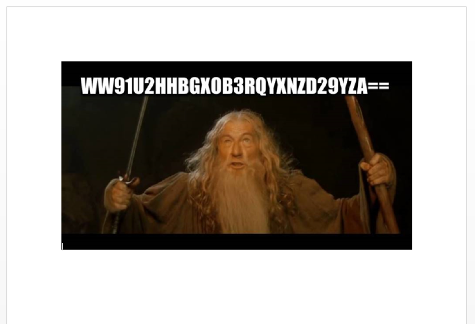
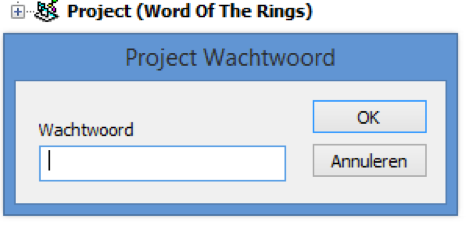
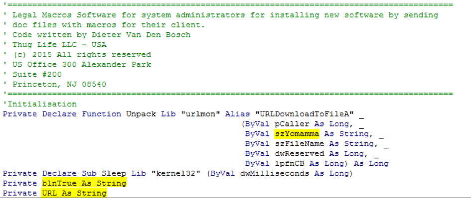
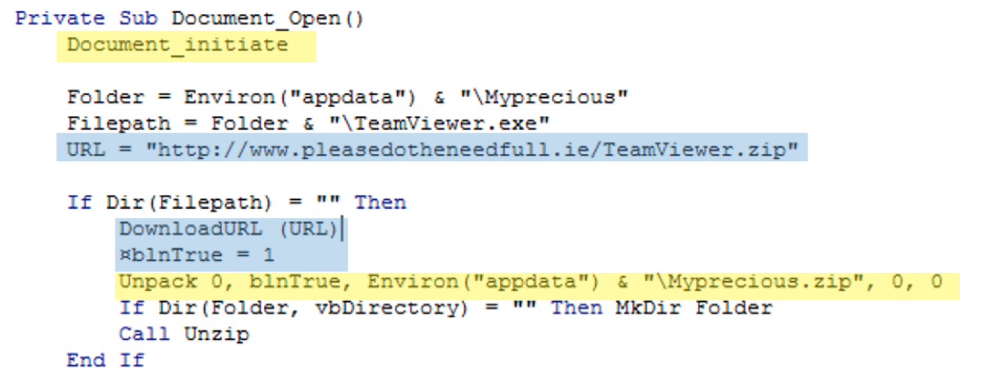
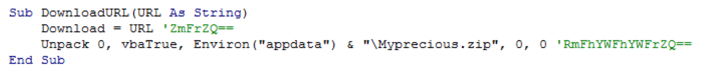
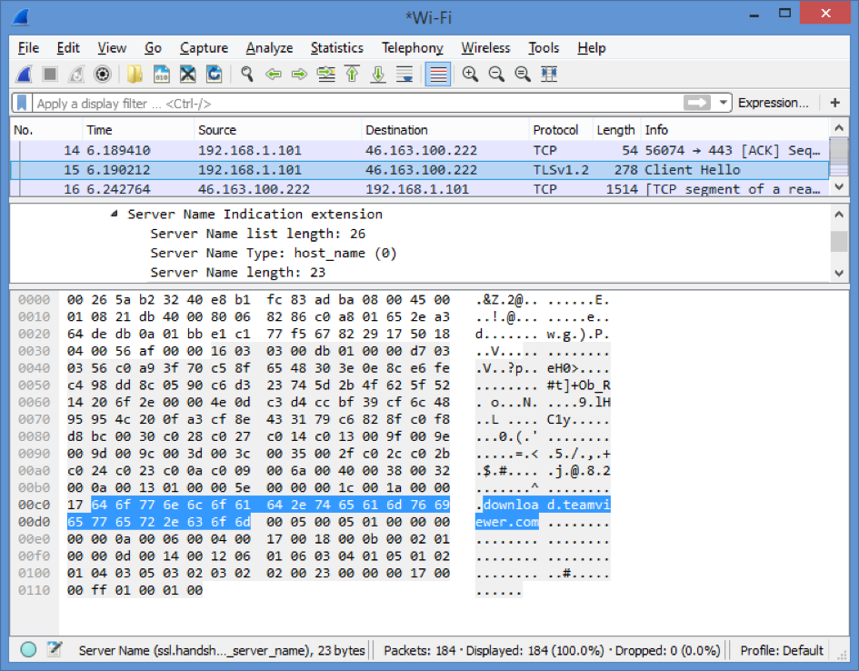
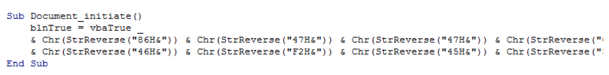

# Cyber Security Challenge 2016: Word of the rings 

**Category:** Reverse Engineering  
**Points:** 40  
**Challenge designer:** Dieter Van Den Bosch 
**Description:**  
> Dear Security Analyst,
Many colleagues are alerting that their computer is acting weird, that their system seems to be controlled by someone else. Some are reporting they received an [attachment](challenge-source-files/Word-of-the-rings.doc) via mail with an image of a face of a really strange old guy who looks like he really needs to go to the toilet. That’s all we know!

> Can you figure out the URL where the Remote Access ‘Trojan’ is downloaded? Then we can look in the logs who is infected and block the URL on the firewall and proxy. Thanks!  
> Cheers,
> Your boss  

**Hints:**
> It's all about that base

## Write-up
So you got a suspicious office document to analyze. Priority number 1 is to analyze whether the document is downloading or installing malicious stuff.
This concept is something Security Analysts do every day. The entire challenge is built around showing what defense skills you have and to improve them. Many hacking challenges focus on the offence part, but in the real world you often don’t get to be a famous Russian l33t attacker (sorry for smashing your dreams!). So let’s see how good you are in ‘defence’.

### Getting hands on the code
It seems that you have a MS Word file with BASE64 text. Or at least that what the ‘=’ signs in the end of the string indicate (as it is often used as padding in BASE64).



When you decode the BASE64 string you get “YouShallNotPassword”. Which is already a hint that you need to enter that string as password somewhere.

Let’s look at the VBA code of the Word-file (ALT+F11). When you want to look at the code it says you need a password, and by now you can guess what it is ;-).



There are other ways to look at the code. There are command-line tools like oledump from Didier Stevens that help you see & analyze the code without needing the password. Or quick tip: if you have OpenOffice you can also view the code without password restrictions.

But you better learn to analyze the code without the use of any tools. If the evil macro makers knew what they were doing (ok admittedly… many of them don’t) you will have some manual analyzing work.

Just so in this challenge. Analyze it with Oledump and you will get a fake URL to mislead you

```bash
$ python oledump.py -p plugin_http_heuristics.py  Word\ Of\ The\ Rings.doc 
A: word/vbaProject.bin
 A1:       445 'PROJECT'
 A2:        41 'PROJECTwm'
 A3: M   15254 'VBA/ThisDocument'
               Plugin: HTTP Heuristics plugin 
                 http://www.pleasedotheneedfull.ie/TeamViewer.zip
 A4:      3424 'VBA/_VBA_PROJECT'
 A5:      2934 'VBA/__SRP_0'
 A6:       217 'VBA/__SRP_1'
 A7:      4660 'VBA/__SRP_2'
 A8:       392 'VBA/__SRP_3'
 A9:       523 'VBA/dir'
```

### Manually analysing the code
So we’ll have to look manually at the code to solve this puzzle. The first lines of code already give you some big hints:



The unusual variable name *szYomamma* is a tip for where to look. URLDownloadToFileA is a function of the Windows API ‘URL moniker service’, held in urlmon.dll, which you can invoke to download a file. Because this way of downloading is so efficient, this function is sometimes used by real malicious office documents.
A bit googling will tell you that this second argument should hold the URL (and that URL is the flag you need to solve this challenge).  
If you look further at the code, you’ll see that blnTrue is disguised as a ‘Boolean’ VBA Data Type (hence the ‘bln’ prefix) but is actually a string. What’s up with that? And variable ‘URL’ … that’s just too easy, right? 

Further below in the code you can see that the variable URL is filled and used in DownloadURL(). In that sub procedure a URL seems to be downloaded. But what are those BASE64 encoded comments doing there?? Decoding the comments will give you ‘fake’ and ‘Faaaaaaake’. I don’t think it gets any clearer then that ;-).


…


So the blue marked code and the DownloadURL sub procedure are fake. That leaves the yellow marked code. If you analyze the code you will see that ‘Document_initiate’ is actually a sub procedure to fill the real URL variable blnTrue and the function with the innocent name ‘Unpack’ is actually the function to download the file behind that URL. So let’s find out what the real URL is …

### Searching for the URL
If you try to sniff with Wireshark from which URL the RAT is downloaded you will be disappointed: the URL is downloaded via HTTPS. Nevertheless you will even find in the SSL traffic a part of the full URL!



Many people think that nobody can sniff what sites & servers you are connecting with when you use HTTPS. However, during the SSL handshake, the remote domain name is transferred over the wire in plain text! Anyone able to sniff the traffic can know exactly what domains you're looking at, even when you're using HTTPS. The DNS traffic (which is mostly clear text) & the rest of the TLS handshake also gives you many clues.

Above you learned variable ‘blnTrue’ contained the real URL that you’re searching for, so let’s search where that variable is filled. There are other functions in the code to mislead you, but doing a simple string search will teach you that these functions are simply not invoked.



blnTrue is filled with vbaTrue, but as this is the only place where vbaTrue is mentioned in the code you know vbaTrue is actually empty and is just a way to fool you into thinking it’s a Boolean value cfr. vbTrue (notice the difference) IS used for Boolean operations. 
If you know a bit about VBA you know the underscore ‘\_’ is a way to get a long statement on multiple lines. So everything after the underscore still belongs to the same statement. So blnTrue is actually filled what all these strange `Chr(StrReverse("86H&"))` things. Decoding this is actually really simple, but you have to do it manually because no tool is able to help you for this. Reversing the string will give you ‘&H68’ which stands for the ASCII character of letter ‘h’. Decode these ASCII characters and you will get the flag you are searching for: **‘https://download.teamviewer.com/download/TeamViewerPortable.zip’**. 
Halelujah! You have made it safely out of Mordor and conquered the Word of the Rings! 

### Why use TeamviewerPortable as as Remote Access Trojan?
Because it works so simple as a proof-of-concept:
* It works in most companies unless they explicitly deny it in their next-generation firewall or their anti-virus. 
* During the challenge there is no hassle with anti-virus products firing or callback servers being hacked by other teams ;-).

But be advised … it is not so hard to do other stuff in evil macro’s like FTP, downloading evil RAT’s, embedding malware, calling home for commands, …

