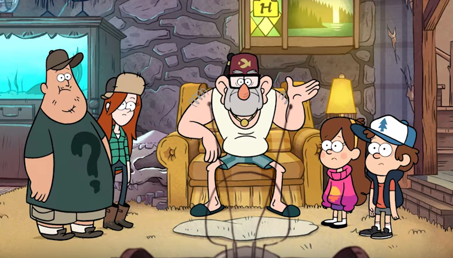
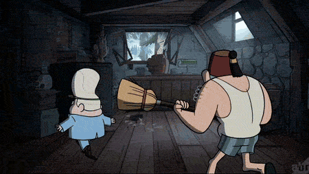

# Juniors CTF 2016 : lost-code-100

**Category:** Crypto
**Points:** 100
**Solves:**
**Description:**

> 
>
> Stan: Kids! Come quick! I need you to laugh at this with me!
>
> 
>
> **Gideon**:  Who's cute as a button He's pretty good and always your friend? Lil' G-I-D to the E-O-N! Wink!
>
> **Dipper**: Gideon?!
>
> **Mabel:** Gideon... Remember when I wouldn't date him and he tried to destroy us?
>
> **Stan:** He's always trying to trick me into losing the Mystery Shack.
>
> **Wendy:** One time I caught him stealing my moisturizer.
>
> **Soos:** And yet, our mutual hatred for him bonds us together.
>
> **On television, voice-over:** Come on down to Li'l Gideon's Tent of Telepathy, opening soon at this location. Dipper: Uh, should we be worried about that?
>
> **Stan**: Please, the only way Gideon's taking over this shack is by breaking in and stealing my deed.
>
> 
>
> **Wendy**: You mean like, right now?
>
> **Gideon:** 38? 41? Oh, heavens to Betsy!
>
> **Stan:** Gideon!!!
>
> 
>
> **Gideon:** Well, well, Stanford, my arch-nemesis. We seem to have entered a dangerous game of cat and mouse. But the question remains, who is the cat, and who is the-
>
> 
>
> **Stan:** Soos, broom.
>
> **Gideon:** Oh no, not the broom!
>
> 
>
> **Gideon:** You mark my words, Stanford, one day I'm gonna get that combination. And once I steal that deed, you'll never see the Mystery Shack again!
>
> **Your hacker skills can be useful. Help Gideon to crack the safe. You`ll need a special [picklock](LosT.zip).**

## Write-up

by [circleous](https://github.com/circleous/)
```
file LosT.x64
LosT.x64: ELF 64-bit LSB executable, x86-64, version 1 (SYSV), statically linked, not stripped
```
Lets take a look on the binary
```
% ./LosT.x64
This is a safe bruteforcer Lost. Try to guess (32*[0-9a-f]:
Success -- 1; Fail --0
Options
-b, start bruteforce
-h, show this help
Example: ./LosT -b 0123456789abcdef0123456789abcdef
```
Given 32 chars [0-9a-f] and we need to make the output to success (all 1).
By finding which byte is true(on)..
```
key    "                                "

test   :88888888888888888888888888888888
result :00000011100000000010000000000001
              ^^^         ^            ^
key	   "      888         8            8"

test   :aaaaaaaaaaaaaaaaaaaaaaaaaaaaaaaa
result :00000000010000000001100000001000
                 ^         ^^       ^
key	   "      888a        8aa       a  8"
.....
```
Write a simple script
```python
import subprocess

alphanumeric = "0123456789abcdef"
key = list(" "*32) # Initialize

def bruteforce():
	for k in range(0, len(alphanumeric)):
		result = subprocess.check_output("./LosT.x64 -b " + alphanumeric[k]*32, shell=True)
		for i in range(0, len(result)):
			if result[i] == "1":
				key[i] = alphanumeric[k]
	return ''.join(key)


def test():
	print bruteforce() # 616dc3888a99170c5b8aa721d925ac68


if __name__ == '__main__':
	test()

# ./LosT.x64 -b 616dc3888a99170c5b8aa721d925ac68
# 11111111111111111111111111111111
```
The flag is `616dc3888a99170c5b8aa721d925ac68`

## Other write-ups and resources

* [Zero Dimension](https://github.com/CTFwriteup-ZeroDimension/JuniorCTF-2016/tree/master/LostCode)
* [SST CTF](https://github.com/SST-CTF/writeups/tree/master/Juniors%20CTF/LosT%20Code)
