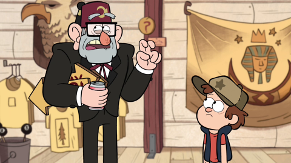
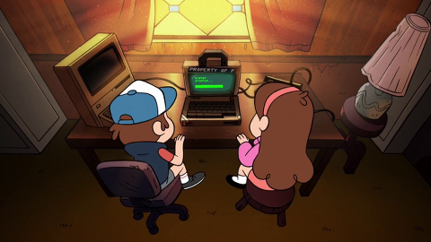
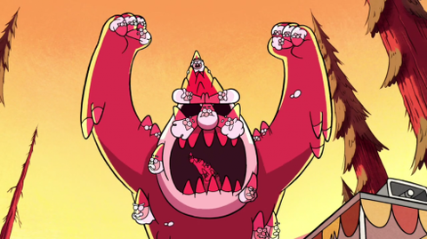

# Juniors CTF 2016 : webmonkey-500

**Category:** Crypto
**Points:** 500
**Solves:**
**Description:**

>
> 
>
> - Dipper, stop doing nothing! It's time to be useful.
>
> - Yeah, Gruncle Stan. What can I do?
>
> - The number of tourists has incredibly fallen. We need a web-site. Nowadays it's impossible to run a business without a web-site.
>
> - Okay, Gruncle, I'll make it. Super site. You will be shocked with a number of visitors arriving here!
>
> Three days later
>
> 
>
> - What are you busy with, Dipper?
>
> - I'm developing a website for Gruncle, Mabel. Actually I've already made it. It's only left to send it to the provider.
>
> - Give me a look... Wow, cool. It even has a flag. But if gnomes find the flag, they may come back. I'm afraid, Dipper.
>
> - Don't be scared. Along with the web-site I've developed a super encoding program. I'll encrypt every file so that gnomes won't understand anything.
>
>
> A few hours later in the gnome den
>
> 
>
> - Hey you, move! Here lies a site. but it's encrypted. You have to find a hidden flag. Otherwise you'll spend your entire life working all days long in our mines. Haha. Get moving.
>
> - And don't be stupid. We have a reserve copy.

## Write-up

(TODO)

## Other write-ups and resources

* none yet
