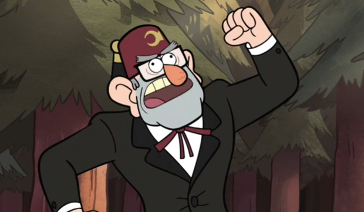

# Juniors CTF 2016 : lost-everything-but-hope-500

**Category:** Forensic
**Points:** 500
**Solves:**
**Description:**

> 
>
> \*screams\*
>
> Mabel: What's up, Gruncle???
>
> Stan: I left a phone here and went to the store to sell something useless. When I got back I saw this
>
> \*shows a broken mobile\*
>
> Mabel: OMG!
>
> Soos: Gonna get some insulating tape.
>
> Stan: Restore the justice!
>
> A few hours later
>
> Dipper: Hm, who could do this?.. Soos, I managed to restore some [files](<https://yadi.sk/d/xpiwWylVzPuse),> maybe you can help to find something. Will you?
>
> Soos: Of course, Dipper.

## Write-up

(TODO)

## Other write-ups and resources

* [Rawsec](http://rawsec.ml/en/JuniorCTF-2016-forensics-Lost-everything-but-hope/)
* [0x90r00t](https://0x90r00t.com/2016/11/27/juniors-ctf-2016-forensic-500-lost-everything-but-hope-write-up/)
