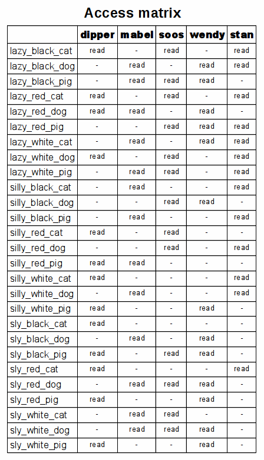

# Juniors CTF 2016 : restricted-area-500

**Category:** Forensics
**Points:** 500
**Solves:**
**Description:**

> 
>
> You are given a trial run as an admin in the Mystery Shack.
>
> Your first task is to define access permissions to the critical information, according to the matrix:
>
> 
>
> The information is stored on the special storage [disk](<https://yadi.sk/d/WF_evB3DyyaXT).> There is also information about system users and a program, which checks, if the settings are correct. If you do it right according to the matrix, you'll receive a flag.

## Write-up

(TODO)

## Other write-ups and resources

* [Yacine Ouarezki](https://github.com/Yacine101/CTF_SOLUTIONS/blob/master/RESTRICTED_AREA_admin.md)
* [Ryosuke SATO](http://jtwp470.hatenablog.jp/entry/juniors-ctf)
* [SST CTF](https://github.com/SST-CTF/writeups/tree/master/Juniors%20CTF/Restricted%20Area)
