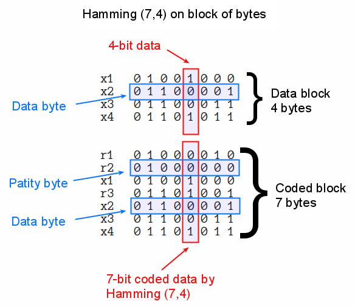

# Juniors CTF 2016 : gladly-the-cross-id-bear-500

**Category:** PPC
**Points:** 500
**Solves:**
**Description:**

> The Internet connection in Gravity Falls is so slow that Dipper has to use a dial-up. However it is still horrible. The phone line is always noisy. Files keep corrupting all the time. Dipper decided to fix the situation by developing an application using noiseless coding. He based it on Hamming code theory (7,4), and modified it for byte blocks transmission.
>
> 
>
> After setting up a number of experiments, he realized a problem of code redundancy and decided to use Hamming code instead (15,11). Dipper rewrote the encoder from scratch but forgot about the decoder.
>
> Help Dipper to decode [a file](image_with_flag_defect.jpg.hamming) and find a flag there.

## Write-up

(TODO)

## Other write-ups and resources

* [SSSpeedgit00](https://ssspeedgit00.github.io/2016/11/28/2016-juniors-CTF/)
