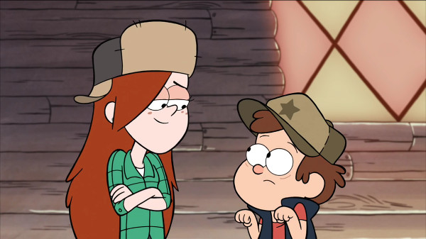
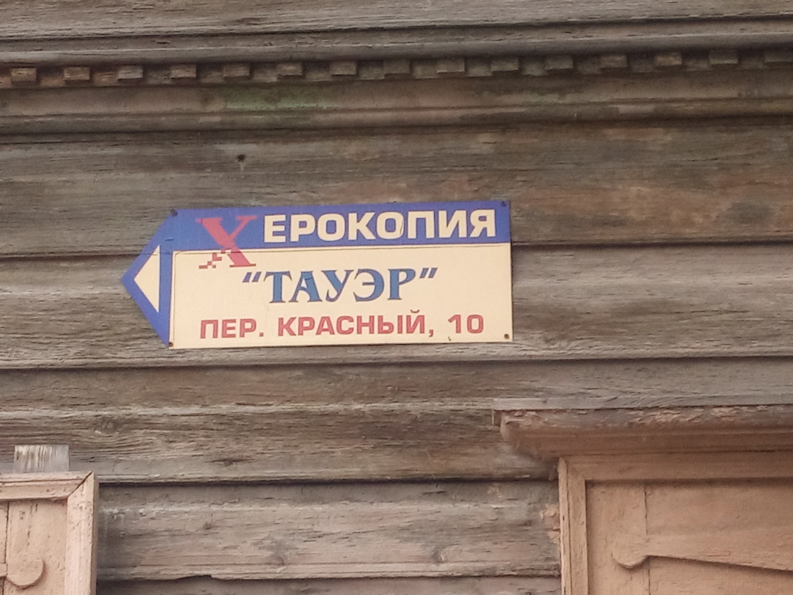

# Juniors CTF 2016 : stop-thief-500

**Category:** Recon
**Points:** 500
**Solves:**
**Description:**

> 
>
> \- Wendy, somebody has stolen Gruncle's xerox
>
> \- I think I know who could do it, Dipper
>
> \- Really???
>
> \- Look, I found that photo. I mentioned something suspicious about it and decided to look it up on vk. And now everything is absolutely obvious
>
> \- Tell me who is it
>
> \- Try to find it out yourself, Dipper.
>
> 

## Write-up

(TODO)

## Other write-ups and resources

* none yet
