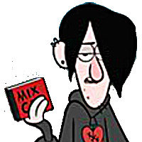

# Juniors CTF 2016 : concatenation-500

**Category:** Reverse
**Points:** 500
**Solves:**
**Description:**

> 
> Hey, Dipper. It's said that you love solving riddles.
>
> 
> Yeah! I've succeeded in solving Gravity Falls mysteries!
>
> 
> Oh, come on!
>
> 
> Just give me one and I'll solve it in the blink of an eye!
>
> 
> Here is a riddle. We'll wait and see how you cope with it.
>
> 
> Easy breezy!
>
> 
> Enjoy concatenating. I'll hang out with Wendy.
>
> 
> How am I supposed to get out of this? I don't know anything about spreadsheets. If I fail, Wendy will be told about that. What can I do? I need someone to help me. But whom could I ask? Yeah! CTF teams, help me!

## Write-up

(TODO)

## Other write-ups and resources

* none yet
