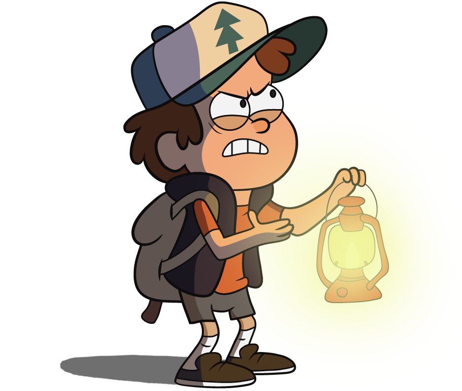

# Juniors CTF 2016 : gravity-authenticator-500

**Category:** Reverse
**Points:** 500
**Solves:**
**Description:**

> 
>
> Gideon talks while sleeping, so now I have his email password. But unluckily I couldn't get access to his mail. He uses one-time passwords passwords as well as regular ones.
>
>
> I managed to steal Gideon's application for one-time password generating (mirror), that he uses for twofactor authentification.
>
> 
>
> But it didn't help me. App was attached to Gideon's computer.
>
> Help me to get primary infill for the generator, so that I could deal with the twofactor authentification.

## Write-up

(TODO)

## Other write-ups and resources

* none yet
