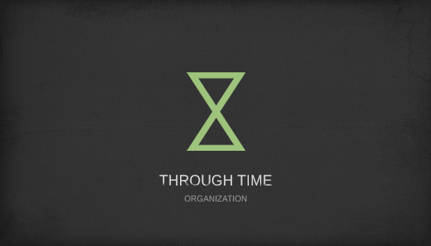

# Juniors CTF 2016 : through-time-500

**Category:** Reverse
**Points:** 500
**Solves:**
**Description:**

> 
>
> **Dipper:** Gruncle Stan, what's this?
>
> **Stan:** It's a program that converts a phrase. The converted representation is legible to time travellers from the future. In approximately 3000 years humans will arrive to a greater understanding about universe. They will have already learnt to send signals to the past and the future.
>
> **Dipper:** That's impossible!
>
> **Stan:** It's science, Dipper. They will even have an organization called "Through time" for managing signal transmission.
>
> **Dipper:** And what next?
>
> **Stan:** Thank to "Through time" a great progress in science will be made. But due to a critical mistake a huge number of people will disapear out from space and time. The organization will be destroyed as well as its works. I used to think that everything is lost until I found a flash memory card and there was [a program on it](https://github.com/circleous/write-ups-2016/blob/c0ba78557acbea572ff4218eb8d8e1e4d22f08ae/juniors-ctf-2016/reverse/through-time-500/ThroughTime.zip) 40 years ago near the police telephone box... Why was it left there?... There was also this: 4(-"K%%+3D!8C6-%5;9;=X-(/, I guess it's a message from fututre. I've always dreamt to know what is it about..
>
> **Dipper:** Gruncle! I can decode it! I need to analyse the encryption algorithm and write a decoder!
>
> **Stan:** Great! Let's do it!

## Write-up

(TODO)

## Other write-ups and resources

* none yet
