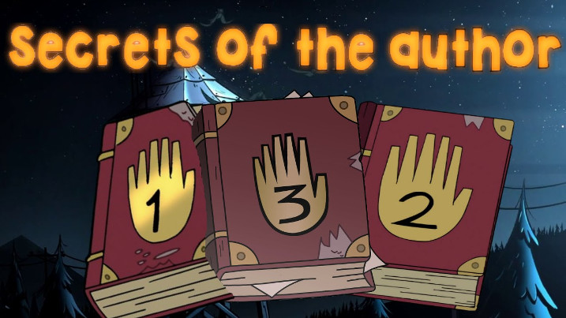
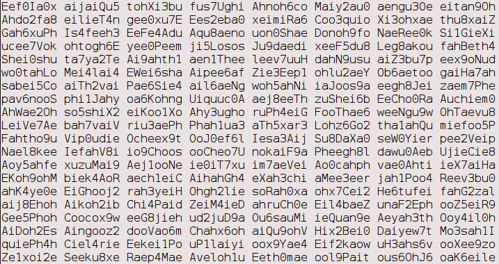

# Juniors CTF 2016 : six-strange-tales-400

**Category:** Web
**Points:** 400
**Solves:**
**Description:**

> 
>
> Gruncle Stan, what's the secret of the six fingered hand?
>
> - Can you see these codes? When the six fingered hand touches them, one of the Gravity Falls secrets opens!
>
> - Gruncle, but how should we read the secret? From left to right or right to left? Or maybe upside down?
>
> - It depends on whether you are a Christian, a Muslim or a Taoist...
>
> 

## Write-up

(TODO)

## Other write-ups and resources

* [Ryosuke SATO](http://jtwp470.hatenablog.jp/entry/juniors-ctf)
* [Rawsec](http://rawsec.ml/en/JuniorCTF-2016-web-Six-Strange-Tales/)
* [0x90r00t](https://0x90r00t.com/2016/11/27/juniors-ctf-2016-web-300-six-strange-tales-write-up/)
* [SST CTF](https://github.com/SST-CTF/writeups/tree/master/Juniors%20CTF/Six%20Strange%20Tales)
