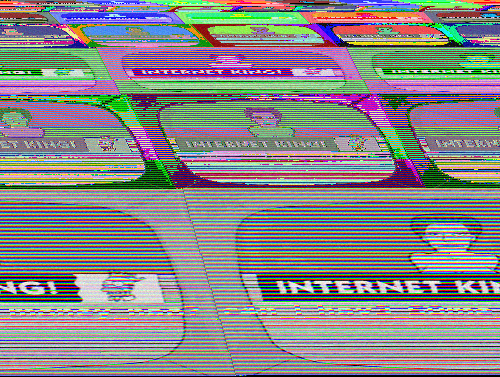
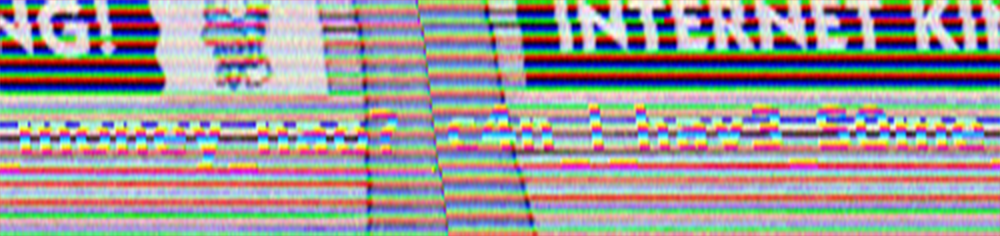
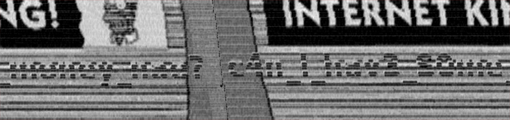

# DEFCON oCTF 2016 - Progressive Encryption

**Category:** Forensics
**Points:** 500
**Author:** Yen
**Description:**

[172.31.0.10/Kathryn_Janeway_Lace_the_Final_Brassiere-59519ec3350e728b1bd8d360c504d369](Kathryn_Janeway_Lace_the_Final_Brassiere-59519ec3350e728b1bd8d360c504d369.png)

## Shortcut Write-up

I used GraphBitStreamer (<https://github.com/old-games/GBS>) to map the entire PNG file as raw image data.  
*(worth noting it only worked because the PNG data stream was uncompressed)*

Parameters:

* 32 bits per pixel (one can easily see 4-byte repetitive patterns spreading thoughout the file)
* True Color palette (since 32 bpp)
* width: 500 px (same as original picture)

Result:

Due to weak encryption silimar to why [encrypted Tux on the Wikipedia page](https://en.wikipedia.org/wiki/Block_cipher_mode_of_operation#Electronic_Codebook_.28ECB.29) is clearly recognizable, we can somewhat figure out the flag written at the bottom.

To make things easier, we can stretch it:

and convert to grayscale:

And the flag can be eyeballed now: `c4n_I_hav3_S0me_money_nao?`

## Intended Way

Inside the PNG we see two chunks: `IDAT` containing the first coarse scan of progressive PNG (hence the name, Progressive Encryption), and `scRT`. Using [xortool](https://github.com/hellman/xortool) on `scRT` chunk contents we can guess that it's encrypted with multibyte XOR cipher with key `nacho` (expected most frequent char `\xFF`). The decrypted contents have a regular `IDAT` chunk, and a new `scRT` appended to it.

Guessing multibyte XOR key over and over for each `scRT` chunk, we decrypt the whole PNG. Keys are:

* `nacho`
* `savages`
* `president`
* `kilobits`
* `monkey`
* `butler`

Resulting reconstructed image:

# Other write-ups and resources

* none yet
