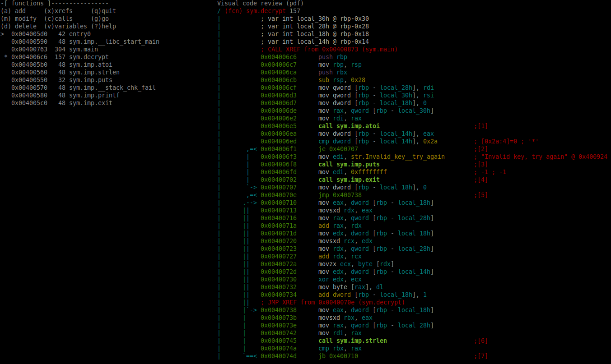

# PentestCyprus 2.0 | Reverse Teaser

**Category:** Reverse
**Points:** N/A
**Solves:** N/A
**Description:**

> [Let's see what you've got!](challenge)

## Write-up

Downloading the file and using `file` on it we see that it's an *ELF* file. So we open it up in `radare2` for investigation  

We type `aa` to analyze all functions  

Then `v` to enter visual mode  

Again `v` to see the Visual code review screen  

  

An interesting function we see is `006c6  157 sym.decrypt`  

Then by looking at the code we see that at `0x004006ed` it does a compare with the value **0x2a** and then a jump if it's equal, else it prints **Invalid key, try again**  

So we do a hex decode of `0x2a` and the value is **42**!

## Other write-ups and resources

* none yet
