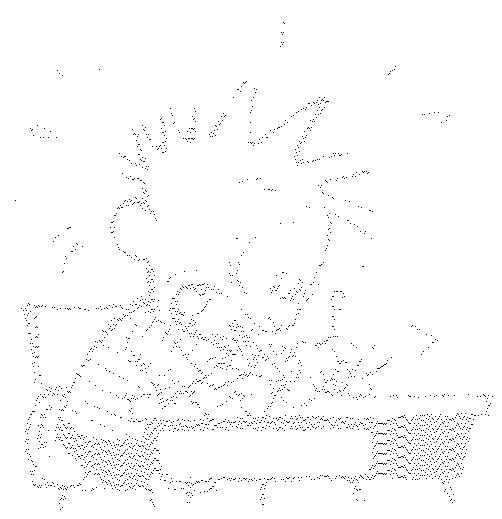

# Pragyan CTF 2016 : Who made me?

**Category:** Steganography
**Points:** 100
**Solves:** 
**Description:**

>   [pixels.jpg.pkl](./pixels.jpg.pkl)  f93b0738aa7746a512bdf2444b83a19b

## Write-up

Writeup by [CeSeNA](https://github.com/cesena)

We have an ASCII text which contains about 10 thousand of lines and at line 2 we read: `S'The black pixels of a b/w image are at'`.

The file seems to have a pattern:
~~~
a(I15
I200
tp2
a(I21
I308
~~~
and so on.

This kind of pattern is a serialized python object: using `pickle` we obtain a list of tuble.
~~~
[(15, 200), (21, 308), (23, 310), (24, 314), (25, 308), (25, 318), (25, 431), (25, 441), ...
~~~

The comment at start suggests to create a blank image where the tuples are the black pixels:

~~~python
import pickle
from PIL import Image

with open('pixels.jpg.pkl') as f:
	data = pickle.loads(f.read().encode('utf8'))

white_pixels = [(int(e[0]), int(e[1])) for e in data[1:]]
width  = max([p[0] for p in white_pixels]) + 10
height = max([p[1] for p in white_pixels]) + 10

image  = Image.new('1', (width, height), 0)
pixels = image.load()

for pixel in white_pixels:
	pixels[pixel[0], pixel[1]] = 255
	
image.show()
~~~

`Who made me?`: the author of 'Calvin and Hobbes' comic is 'Bill Watterson' and the flag is `billwatterson`

## Other write-ups and resources
