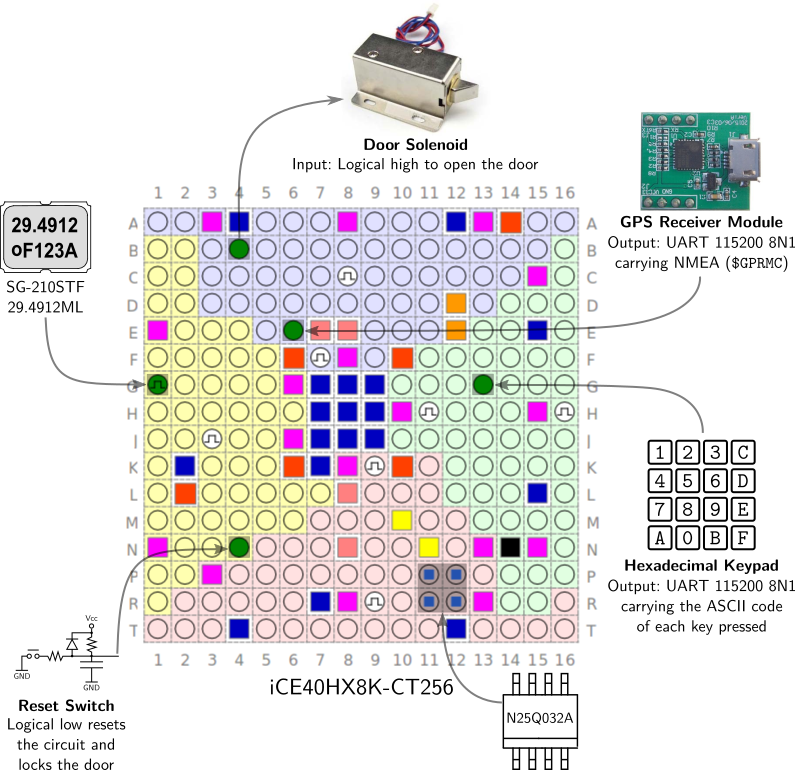
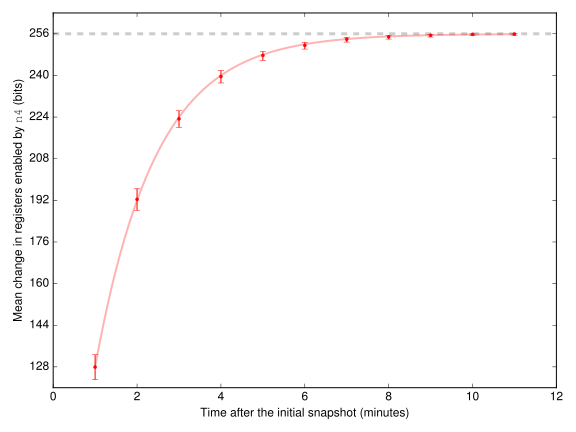
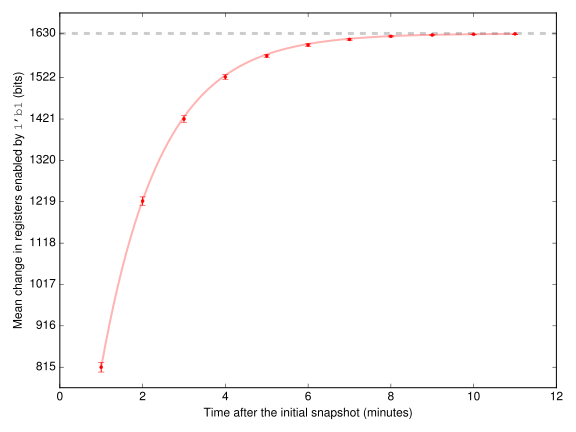

# Pwn2Win CTF 2016: Timekeeper's Lock

**Category:** Reverse
**Points:** 600
**Solves:** 0
**Description:**

> In order to protect their maximum security facilities, the Club employs
> an electronic security lock activated by a 256-bit key which changes every
> minute. When a Club member is authorized to enter some of these facilities,
> he receives this key in hexadecimal format, the same format which is used to
> enter the key in the electronic lock’s keyboard. The last year (in 2015),
> Project SKY intercepted a key valid for April 1st at 11:00 UTC:
> 01cd9de119e1231e29b0972a618da6c79fc1f3bd96cee86c93a8068bdc5e4c59,
> however we got access to this key only after it was already expired.
> It seems that these keys are the same for all facilities, independent from
> their geographical location, that is, they vary only with time. This year,
> our truck driver Alisson, undercover in the Club’s fleet, was able to
> intercept the shipment of one of these locks to a warehouse which is
> currently under construction. Quickly, he drafted a block diagram of
> the lock’s circuit and generated a dump of the flash memory (N25Q032A),
> both contained in the file which we are providing to you. A few minutes
> after sending this information through 3G using his Samsung Note Edge™
> smartphone, Alisson suffered a tragic transit accident, which means
> the Club has probably discovered our plans, so that we have only 48h before
> they change all of their electronic lock scheme. Our teams are ready to
> deploy next to 3 facilities of critical importance to the Club. They only
> need that you send a key valid for the current minute to the address
> https://door.pwn2win.party/KEY.




## Write-up

### Preparing the environment

Some tools and libraries must be installed in order to run this write-up.

 * Download and build [IceStorm](https://github.com/cliffordwolf/icestorm).

```
sudo apt-get install libftdi-dev
mkdir -p ~/git; cd ~/git
git clone https://github.com/cliffordwolf/icestorm.git
cd icestorm
git checkout -b ctf eb85e29ff0ca7b9031cf21db3dccaa70b7ef567a
make CXX=g++
```

 * Set the `ICESTORM` environment variable to the IceStorm repository path.

```
export ICESTORM=$HOME/git/icestorm
```

 * Install [Verilator](http://www.veripool.org/wiki/verilator).

```
sudo apt-get install verilator
```

 * Install [Python 3](https://www.python.org).

```
sudo apt-get install python3
```


### Reversing the FPGA bitfile

We have chosen the iCE40HX8K-CT256 chip to implement this challenge because mature and modern reverse engineering tools are available for it.

The `iceunpack` and `icebox_vlog.py` tools from [IceStorm](https://github.com/cliffordwolf/icestorm) are able to transform the FPGA bitfile into an equivalent circuit in Verilog RTL.

This write-up provides a Makefile target to run these tools. Just type:

```
make chip.v
```


### Simulating the circuit given an input

First, the competitor was expected to set up a working simulation of the FPGA circuit. We provided the sample key mainly to allow such a simulation to be more easily validated, as our circuit has no output pins for flagging errors such as malformed UART signals or NMEA sentences.

The circuit could be simulated with any Verilog simulator, in particular free-software ones, such as [iverilog](http://iverilog.icarus.com) and [verilator](http://www.veripool.org/wiki/verilator). However, iverilog is very slow for simulating such a large and complex (decomposed) circuit. A single simulation takes near 2 minutes to run on iverilog in modern hardware. On the other hand, verilator is pretty fast, and runs the same simulation in 3 seconds. Another advantage of verilator is that it allows every internal digital signal to be easily controlled by C++ code during the simulation.

In order to correctly control the input pins, the competitor must be able to compute the duration, in number of cycles, of each bit sent over UART (29.4912×10⁶ / 115200 = 256) and to correctly generate the 8N1 framing.

In this write-up, we simulate the circuit with verilator. A Makefile target is available for building the simulator executables. Compile the `sim_input` simulator by typing:

```
make sim_input
```

Pass the Keypad and GPS UART inputs as arguments to `sim_input`. It can also optionally receive a third argument to save a waveform dump to a file. At the end of simulation, it outputs `lock: 1` if the door is open, or `lock: 0` if it is closed.

```
$ ./sim_input 01cd9de119e1231e29b0972a618da6c79fc1f3bd96cee86c93a8068bdc5e4c59 \
  '$GPRMC,110000.000,A,1547.9730,S,4751.8510,W,0.02,31.66,010415,,,A*61' \
  dump.vcd
lock: 1
```

The waveform dump can be opened with [GTKWave](http://gtkwave.sourceforge.net).

```
gtkwave dump.vcd
```

### Observing the waveforms


By observing the waveform dump above, several interesting remarks can be made:

 * Signal `n2` pulses 10 times. If we observe the pulse position relative to the NMEA UART signal (`pin_E6`), we discover that the first 4 pulses occur at the stop bit of each character pertaining to the current time (hour and minute) in a `$GPRMC` sentence. Similarly, the last 6 pulses occur at the stop bit of each character belonging to the current date (day, month and year).

 * Signal `n6` pulses 64 times. Each pulse occurs at the stop bit of a hexadecimal digit character received from the keypad (`pin_G13`).

 * Most signals (`n8`–`n14`, `n17`, `n19`–`n23`, `n26`, and several others if we scroll down) only present activity (toggling) during a short period of time after both UARTs have finished receiving their data. Therefore these signals are probably related to key calculation.


By zooming around the time when the door opens (`pin_B4` becomes high), we can make additional remarks:

 * Signal `n4` only becomes high for 4 cycles, just before the door opens.

 * Even more evidence shows that `n8`–`n14` and others are related to key calculation, as their toggle rate is quite high (near clock speed), and all activity ceases just before the circuit decides to open the door.


### Gathering information about registers

By typing:

```
make reginfo.h
```

Our Makefile runs a very simple parser which gathers a list of all the registers present in the `chip.v` file and their enable signals. The script also prints the table below.

| Enable signal | Number of registers |
|---------------|---------------------|
| `1'b1`        | 1762                |
| `n1`          | 50                  |
| `n145`        | 10                  |
| `n2`          | 48                  |
| `n4`          | 256                 |
| `n4357`       | 1 (`pin_B4`)        |
| `n4457`       | 1 (`n4456`)         |
| `n6`          | 256                 |

Taking into account the behavior observed for the enable signals in the simulation waveforms and the fact that the size of the key is 256 bits, the table above provides evidence that:

 * Registers enabled by signal `n6` probably hold the key typed in the keypad, as this signal is activated on each keystroke.

 * Registers enabled by signal `n4` might hold the correct key, as they only change (and rapidly stabilize) immediately before the door opens.


### Locating keypad registers

Although at this point we have evidence that registers enabled by `n6` hold the key typed in the keypad, important issues remain:

 * The key might have suffered some transformation before being stored in the registers. We still cannot be sure that the key is stored exactly as typed.

 * Even if the key is stored exactly as typed, simply knowing which are the members of the unordered set of 256 registers does not help much, since they can be ordered in any of 256! possible permutations.

If the key is transformed at most in a linear way after typed, it should be possible to activate each bit of the key at a time and afterwards study the change it causes in registers.

Typing the command below will employ this approach to map which registers become high when each bit of the key is set to high.

```
make -j8 keypad_regs.h
```

Looking at the results, we can conclude that:

 * The key is stored exactly as typed. Each bit of the key is tied to a single register enabled by `n6` and vice-versa.

 * The 4 least significant bits of the key affect, besides their respective `n6`-enabled register, also a single register enabled by `1'b1`. These probably form a buffer which stores the last typed hexadecimal digit, but this hypothesis is not needed to solve the challenge.


### Analyzing registers affected by NMEA input

If the correct key is computed as a cryptographically-secure hash from the current date and time provided by NMEA, we expect that after each minute, a 50% probability exists of each bit of the key being flipped.

This fact can be exploited to gain more confidence that registers enabled by `n4` hold the correct key. Below, we simulate the circuit receiving some random initial date and time, take a snapshot of the register values, then simulate again 11 times, each one incrementing the time by one minute. Finally, we plot how many registers flipped at least once across the snapshots taken after each simulation.



Above we observe that, given enough time, every register enabled by `n4` will eventually have changed at least once. As we know the size of the key is 256 bits, then the registers enabled by `n4` are rather suspicious of holding the correct key.



Besides registers enabled by `n4`, the only others affected by a change in date and time (when other inputs are fixed) are a subset of the registers enabled by `1'b1` (above). Going further, although not required to solve the challenge, we can hypothesize that they hold the hash algorithm's internal state. Looking at the size of this internal state, if we knew the circuit implements a [NIST-approved hash algorithm](https://en.wikipedia.org/wiki/Template%3AComparison%5Fof%5FSHA%5Ffunctions), we could even deduce it was SHA-3. ;)

### Reproducing the plots

If you intend to plot the figures above, first install the following scientific libraries for Python 3:

```
sudo apt-get install python3-matplotlib python3-scipy python3-pip
sudo -H python3 -m pip install lmfit
```

Then run the corresponding Makefile target for each figure.


### Obtaining the key

Now that we got an overview of the circuit's behavior, we shall present two different ways to solve the challenge.


#### The Trickster's Way

If we assume the correct key is stored in the unordered set of registers enabled by `n4`, the same issues we encountered when locating keypad registers arise again. The key bits might be ordered in any of the 256! possible permutations. Brute-forcing the correct order is computationally infeasible. Therefore, we need to find an efficient way to sort the key bits.

First, we put the circuit into a state in which the door is open, by providing as inputs to the simulation the sample key given in the problem's statement, and a NMEA sentence containing the corresponding date/time during which that key is valid.

Then, we toggle one of the registers enabled by `n4`. This causes the door to close. After that, we try to open the door again by toggling each of the keypad bits. When the door opens, it means we have found to which bit of the key that register is related. We repeat this procedure for each of the registers enabled by `n4`.

This algorithm is very efficient because, at each of the 256² required iterations, we only need to simulate the circuit for a single clock cycle, since the location of the registers holding keypad bits is already known.

Once the key registers are sorted in the correct order, we can simulate the circuit providing any NMEA sentence and afterwards extract the key from these registers.

The tool which implements this method can be compiled by typing:

```
make extract_hash
```

The tool may be called passing as arguments any time and date in the `HHMM ddmmyy` format:

```
$ ./extract_hash 1100 010415
01cd9de119e1231e29b0972a618da6c79fc1f3bd96cee86c93a8068bdc5e4c59
```

If no arguments are provided, the tool prints the correct key for the current minute (in UTC).


#### The Mathematician's Way

Although the method we just explained is very efficient and relatively easy to implement, it is not general, and would not work:

 * If no sample key was provided in the problem's statement.

 * If the registers holding the correct key did not held it exactly as expected to be typed by the user, e.g. if the hash suffered some final transformation before being compared to keypad bits.

A more general approach is to remember that the problem of finding a set of inputs such that the output of an arbitrary digital circuit goes to logical high is a [boolean satisfiability problem](https://en.wikipedia.org/wiki/Boolean_satisfiability_problem).

If we transform the problem to the [conjunctive normal form](https://en.wikipedia.org/wiki/Conjunctive_normal_form), we can feed it to a [SAT solver](http://minisat.se), which will hopefully find the answer in reasonable time (although there are no guarantees, of course, since SAT is a NP-complete problem).

The [Tseytin transformation](https://en.wikipedia.org/wiki/Tseytin_transformation) can be employed to transform a digital circuit to the conjunctive normal form. The equivalent circuits generated by IceStorm only use the following Verilog operations:

| Operation      | Tseytin transformation                                 |
|----------------|--------------------------------------------------------|
| c = a & b      | (¬a∨¬b∨c)∧(a∨¬c)∧(b∨¬c)                             |
| c = a ⎮ b      | (a∨b∨¬c)∧(¬a∨c)∧(¬b∨c)                              |
| d = a ? b : c  | (a∨c∨¬d)∧(¬a∨b∨¬d)∧(b∨c∨¬d)∧(¬a∨¬b∨d)∧(a∨¬c∨d)  |

The `solve_circuit.py` tool takes:

 * The assignments contained in the Verilog RTL file generated by IceStorm.

 * A problem specification containing:

    * constraints, e.g. the door must be open;

    * known values for some identifiers;

    * identifiers whose value we are seeking for (the *incognita*).

It parses the assignments using a simple [Grako](https://pypi.python.org/pypi/grako/3.6.7) grammar, applies the Tseytin transformations presented above, and calls [MiniSat](http://minisat.se) to solve for the value of the *incognita*.

The problem specification is generated by the `solve_hash` tool, which simulates the circuit given some NMEA input, lists the keypad registers as *incognita*, and dumps a snapshot of every other register. The `solve_circuit.py` tool is automatically called by `solve_hash`.

To run these tools, first install the following additional prerequisites:

```
sudo apt-add-repository ppa:pypy/ppa && sudo apt-get update
sudo apt-get install pypy
wget https://bootstrap.pypa.io/get-pip.py && sudo -H pypy get-pip.py
sudo -H pypy -m pip install grako
sudo apt-get install minisat
```

Then compile the tool:

```
make solve_hash
```

The command line arguments accepted by `solve_hash` are exactly the same as the ones accepted by `extract_hash`:

```
$ ./solve_hash 1100 010415
WARNING: for repeatability, setting FPU to use double precision
============================[ Problem Statistics ]=============================
|                                                                             |
|  Number of variables:         12760                                         |
|  Number of clauses:           10543                                         |
|  Parse time:                   0.00 s                                       |
|  Simplification time:          0.00 s                                       |
|                                                                             |
============================[ Search Statistics ]==============================
| Conflicts |          ORIGINAL         |          LEARNT          | Progress |
|           |    Vars  Clauses Literals |    Limit  Clauses Lit/Cl |          |
===============================================================================
===============================================================================
restarts              : 1
conflicts             : 0              (0 /sec)
decisions             : 1              (0.00 % random) (250 /sec)
propagations          : 12760          (3190000 /sec)
conflict literals     : 0              (-nan % deleted)
Memory used           : 24.00 MB
CPU time              : 0.004 s

SATISFIABLE
01cd9de119e1231e29b0972a618da6c79fc1f3bd96cee86c93a8068bdc5e4c59
```


## Other write-ups and resources

* [Challenge source code](https://github.com/epicleet/timekeeperslock)
* [Dragon Sector](http://dragonsector.pl/docs/pwn2win2016_writeups.pdf)
