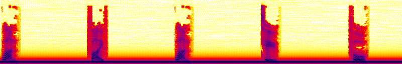

#Volga CTF Quals 2016 yacst2 writeup

###*Category:* PPC *Points:* 350

> Captcha is a modern simple Turing test for everyday use, for human it's simple, but for bot or a simple neural network captcha can become a hard nut to crack.
>
> You can try to solve it with your AI too, but it definitely can be solved with several lines of code, isn’t it?
>
> Hints
> * gist
> * gist2 Adding a Noise

http://yacst2.2016.volgactf.ru:8090/

[gist](https://gist.github.com/volalex/799789663f8c29f1bb58)
[gist2](https://gist.github.com/volalex/4c62beaa721807dbc139)

## write-up

There are few opportunities to do it:

  * Use google servers for recognition (slow; boring; not free)
  * Use some audio recognition package. I've tried two of them: could not understand how to use them
  * My choice: imagemagick.

Yes, imagemagick.

Let's look at captcha [spectrogram](https://en.wikipedia.org/wiki/Spectrogram):

```
sox new.wav -n spectrogram -Y 130 -l -r -o new.wav.png
```



Because the voice is artificial, all the sounds really look the same.
This way, we can work with spectrogram like with usual captcha.

At the bottom of the image you can see some low-frequency noise. We have to cut it and with imagemagick it's really easy. Moreover, sound vary in length.
Now you can use your favourite captcha solver or continue reading.

First of all, we have to cut the spectrogram and binarize it.

```
convert new.wav.png -colorspace gray  -colors 2  -normalize -crop 100000x80+0+0 gray.new.wav.png
```


Next step is separating every sound. I've used my old script (you can find it as split.py in `files.tar.gz`) for it. It simply iterates over every image column and return regions which contains at least one black pixel.

There was a problem with it: sound "nine" on spectrogram was sometimes separated incorrectly (two images instead of one). I could fix that easily even without editing python script, but the result was 80% successful, so I did not bother.

```
python3 split.py gray.$1.png | (let imgn=0; while read eh begin end; do

  echo "found region $begin $end"
   convert gray.new.wav.png -crop $(($end-$begin))x80+$begin+0 -resize 50x80\! out.gray.new.wav.$imgn.png;

  let imgn++
done; )
```

As you can se, I've forced cropping every symbol to a 50x80 (by `-resize 50x80\!`). It makes symbols with different lengths look the same.

Then, I listened to few captchas and made a symbol table (from zero to nine):

 
 
 
 
 

The easiest part! We have to compare the splitted image to all the templates. Images are compared by calculating a difference image:

  * Create the difference image
  * Count the number of white pixels on it
  * The image with the less white pixels is the the template of our symbol

An example of difference:


```
for s in $(seq 0 9); do
  # make the difference
  composite new.wav.symbol0.png template_$s.png -compose difference difference.png
  # count white pixels
  whites=$(convert test.png -define histogram:unique-colors=true -format %c histogram:info:- | grep '255,255,255' | awk -F: '{print $1}')
  # echo it
  echo 0$(echo -ne $whites | tr -d ' \t') $s
done | sort -n | head -n1 | cut -d' ' -f2 # select an entry with the less white pixels
```

That's it! Captcha is broken. There is an exploit code:

It took about 3 hours to break through 3000 cycles. Every captcha was downloaded in about 2 seconds and recognitized in about a half on my laptop.

    CURL() { curl -L -H 'Cookie: JSESSIONID=05e2AjABG9POA_Hgl6lwP1lzeyD3lIVFQKi5cNeU' $@; }
    while :; do
      # recieve new captcha
      CURL http://yacst2.2016.volgactf.ru:8090/captcha > new.wav
      # parse it
      REPLY=$(bash do.sh new.wav | grep -v region | tr -d '\n')
      echo $REPLY
      # send reply
      CURL --data "captcha=$REPLY"
    done

## Other write-ups and resources

* <https://github.com/EspacioTeam/write-ups/tree/master/2016/volga/YACST2>
* [P4 Team](https://github.com/p4-team/ctf/tree/master/2016-03-26-volga2016-quals/yacs2)
* <https://der.ttyh.ru/blag/post/yacst-writeup/>
